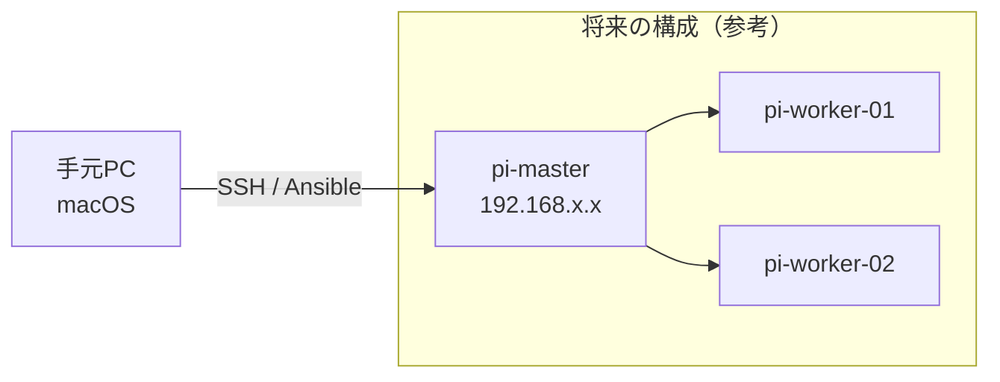
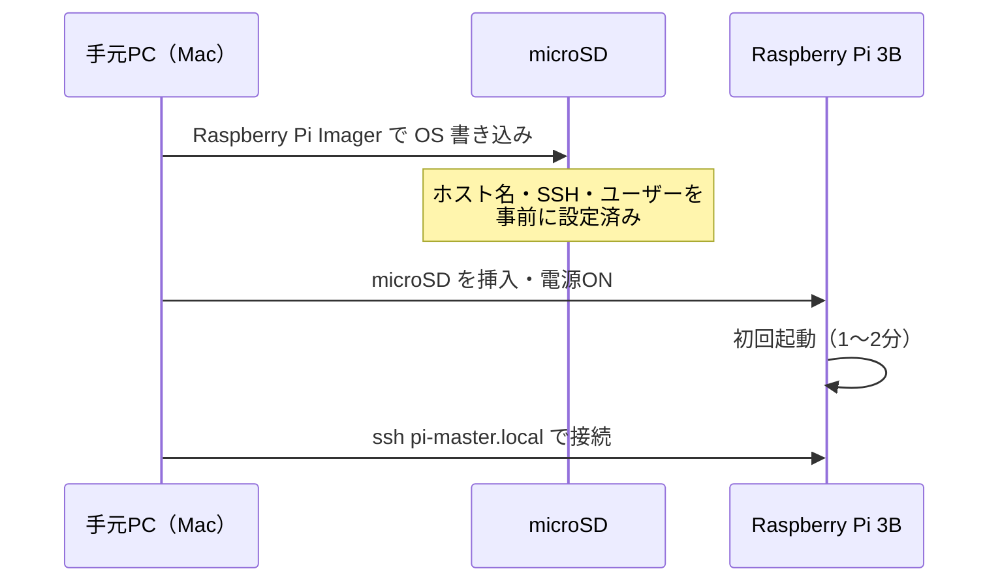

# 01. ハードウェア準備と OS 初期セットアップ

## このセクションで学ぶこと

- Raspberry Pi Imager を使って microSD カードに OS を書き込む
- 初回起動前に SSH・ホスト名・ユーザーを設定する（ヘッドレスセットアップ）
- 手元の Mac から SSH で接続できる状態にする

---

## なぜ必要か

分散処理では複数のノードを**ディスプレイもキーボードも接続せず**にリモートから操作する。
この「ヘッドレス（headless）セットアップ」は、ステージ1以降でノードを追加・再構築するたびに繰り返す基本作業になる。
今ここで1台を確実に仕上げることで、将来ノードを増やすときも迷わない。

---

## 概念の説明

### ノードとクラスタ

**ノード（node）**：クラスタを構成する1台のコンピューター。今回の `pi-master` がそれ。  
**クラスタ（cluster）**：複数のノードをネットワークでつないで、1つのシステムとして扱う構成。



### ヘッドレスセットアップの流れ



### arm64 とは

Raspberry Pi 3B は ARM Cortex-A53 という 64ビット対応の CPU を搭載している。
このアーキテクチャを **arm64**（または aarch64）と呼ぶ。x86（Intel / AMD）とは異なるため、
ソフトウェアのバイナリやコンテナイメージは arm64 対応のものを使う必要がある。

---

## ハンズオン手順

### 準備するもの

| 品名 | 仕様 | 備考 |
|------|------|------|
| Raspberry Pi 3 Model B | — | 本体 |
| microSD カード | 32GB 以上、Class 10 / A2 推奨 | 遅いカードは起動も遅くなる |
| microSD カードリーダー | Mac に差せるもの | Mac に SD スロットがあれば不要 |
| micro-USB ケーブル + 電源アダプタ | 5V / 2.5A 以上 | スマホ充電器は出力不足のことがある |
| LAN ケーブル | — | 有線接続を強く推奨 |

---

### 手順1：Raspberry Pi Imager のインストール（手元Mac）

**実行マシン：手元PC（Mac）**

1. Raspberry Pi の公式サイトからインストーラーをダウンロードする。  
   https://www.raspberrypi.com/software/

2. ダウンロードした `.dmg` を開き、Raspberry Pi Imager を `/Applications` にドラッグする。

3. Imager を起動する。

```
# Homebrew を使っている場合は以下でもインストールできる
brew install --cask raspberry-pi-imager
```

---

### 手順2：OS と書き込み先の選択（手元Mac）

**実行マシン：手元PC（Mac）**

1. microSD カードをカードリーダーに差し込み、Mac に接続する。

2. Imager の画面で順番に選択する：

   | 項目 | 選択内容 |
   |------|---------|
   | **Raspberry Pi デバイス** | Raspberry Pi 3 |
   | **OS** | Raspberry Pi OS（other）→ **Raspberry Pi OS Lite (64-bit)** |
   | **ストレージ** | 接続した microSD カード（容量で確認する）|

   > ⚠️ **ストレージの選択を間違えると Mac の内蔵ディスクを上書きしてしまう。** 容量を必ず確認すること。

3. **「次へ」を押す前に**、右下の「設定を編集しますか？」ダイアログで **「設定を編集する」** を選ぶ。

---

### 手順3：詳細設定（ヘッドレスセットアップの要）（手元Mac）

**実行マシン：手元PC（Mac）**

Imager の「OS カスタマイズ」画面で以下を設定する。

#### 「一般」タブ

| 設定項目 | 値 | 説明 |
|---------|-----|------|
| ホスト名 | `pi-master` | ネットワーク上での名前。`pi-master.local` でアクセスできるようになる |
| ユーザー名 | 任意（例：`pi`）| SSH ログイン時に使う |
| パスワード | 強いパスワードを設定 | 後で鍵認証に切り替えるが、今は必要 |
| Wi-Fi | 使う場合は SSID とパスワードを入力 | 有線 LAN のみ使う場合は不要 |
| ロケール | タイムゾーン：`Asia/Tokyo`、キーボード：`jp` | |

#### 「サービス」タブ

| 設定項目 | 値 |
|---------|-----|
| SSH を有効にする | ✅ オン |
| 公開鍵認証を使用する | ✅ オン |
| 公開鍵 | Mac の公開鍵を貼り付ける（後述）|

**Mac の公開鍵の確認・生成方法：**

```bash
# 手元Mac のターミナルで実行

# 既存の公開鍵を確認する
cat ~/.ssh/id_ed25519.pub
# または
cat ~/.ssh/id_rsa.pub

# 鍵がない場合は新しく作る（ed25519 を推奨）
ssh-keygen -t ed25519 -C "your-email@example.com"
# 保存先はデフォルト（Enter を押すだけ）、パスフレーズは設定を推奨

# 生成した公開鍵を表示する
cat ~/.ssh/id_ed25519.pub
```

表示された `ssh-ed25519 AAAA...` から始まる1行を Imager の公開鍵欄に貼り付ける。

---

### 手順4：microSD への書き込み（手元Mac）

**実行マシン：手元PC（Mac）**

1. 設定を確認したら「保存」→「はい」（カスタマイズを適用）を選ぶ。
2. 「書き込む」をクリックする。  
   → 書き込み中は Mac のパスワードを求められる場合がある。
3. 書き込みと確認（Verify）が完了するまで待つ（5〜10分程度）。
4. 完了したら microSD を安全に取り出す。

---

### 手順5：Raspberry Pi の起動（pi-master）

**実行マシン：pi-master（物理操作）**

1. 書き込み済みの microSD を Raspberry Pi 3B の裏面スロットに挿入する（カチッと奥まで）。
2. LAN ケーブルをルーターまたはスイッチに接続する。
3. micro-USB ケーブルで電源を接続する。  
   → 赤い LED が点灯し、起動が始まる。緑の LED が点滅し始めたら OS が読み込まれている。
4. **初回起動は2〜3分かかる**（SSH ホストキーの生成などが行われる）。  
   → 緑 LED の点滅が落ち着くまで待つ。

---

### 手順6：SSH で初回接続（手元Mac）

**実行マシン：手元PC（Mac）**

1. ターミナルを開き、SSH で接続する。

```bash
# ホスト名で接続する（Bonjour / mDNS を使用）
ssh pi@pi-master.local
# ユーザー名は手順3で設定したものに合わせる
```

2. 初回接続時に次のメッセージが出る。`yes` と入力する。

```
The authenticity of host 'pi-master.local (192.168.x.x)' can't be established.
ED25519 key fingerprint is SHA256:xxxxxxxxxxxxxxxxxxxxxxxxxxxx.
Are you sure you want to continue connecting (yes/no/[fingerprint])? yes
```

3. 接続に成功すると、次のようなプロンプトが表示される。

```
pi@pi-master:~ $
```

4. 接続を確認したら、ラズパイの IP アドレスをメモして `docs/hardware.md` に記録する。

```bash
# pi-master 上で実行：IP アドレスを確認する
hostname -I
```

---

## 確認方法

**手元Mac のターミナルで実行：**

```bash
# 1. SSH で接続できることを確認
ssh pi@pi-master.local echo "接続成功"
```

期待される出力：
```
接続成功
```

```bash
# 2. 64ビット OS で動いていることを確認（pi-master 上で実行）
uname -m
```

期待される出力：
```
aarch64
```

```bash
# 3. OS のバージョンを確認（pi-master 上で実行）
cat /etc/os-release | grep -E "^(NAME|VERSION)"
```

期待される出力（例）：
```
NAME="Debian GNU/Linux"
VERSION="12 (bookworm)"
```

```bash
# 4. ホスト名が正しく設定されていることを確認（pi-master 上で実行）
hostname
```

期待される出力：
```
pi-master
```

---

## よくあるトラブルと対処

### トラブル1：`ssh: Could not resolve hostname pi-master.local`

**原因：** Mac と Raspberry Pi が同じネットワークにいない、または mDNS（Bonjour）の名前解決に失敗している。

**対処：**
```bash
# ルーターの管理画面でラズパイの IP アドレスを調べ、直接接続する
ssh pi@192.168.x.x   # x.x は実際の IP に置き換える

# または Mac 上で ARP テーブルを確認する
arp -a | grep -v incomplete
```

IP アドレスで接続できた場合は、以降の手順で `~/.ssh/config` を設定して短縮できる（04-ssh.md で扱う）。

---

### トラブル2：SSH 接続時に `Permission denied (publickey)` が出る

**原因：** Imager の詳細設定で公開鍵が正しく設定されなかった、または SSH 鍵が一致していない。

**対処：**
```bash
# 手元Mac の公開鍵を確認する
cat ~/.ssh/id_ed25519.pub

# パスワード認証を試みる（Imager でパスワードを設定した場合）
ssh -o PubkeyAuthentication=no pi@pi-master.local
```

パスワードで接続できた場合は、接続後に以下を実行して公開鍵を手動で登録する：
```bash
# pi-master 上で実行
mkdir -p ~/.ssh && chmod 700 ~/.ssh
# Mac からコピーしてきた公開鍵の内容を貼り付ける
echo "ssh-ed25519 AAAA..." >> ~/.ssh/authorized_keys
chmod 600 ~/.ssh/authorized_keys
```

---

### トラブル3：電源を入れても起動しない、または途中で止まる

**原因A：** 電源アダプタの出力が不足している（5V / 2.5A 以上が必要）。  
**対処A：** Pi 3B 対応の電源アダプタに交換する。スマートフォン充電器は多くが 1A 以下で不足する。

**原因B：** microSD の書き込みが不完全。  
**対処B：** Imager で書き込みをやり直す。「書き込み後に確認する」オプションを必ず有効にする。

**原因C：** microSD が奥まで刺さっていない。  
**対処C：** カチッという感触があるまで押し込む。

---

### トラブル4：`WARNING: REMOTE HOST IDENTIFICATION HAS CHANGED!` が出る

**原因：** 以前に別の機器が同じホスト名やIPアドレスを使っていた場合に起こる。OS の再インストール後にも出る。

**対処：**
```bash
# 手元Mac で古い known_hosts エントリを削除する
ssh-keygen -R pi-master.local
ssh-keygen -R 192.168.x.x  # IP アドレスも削除

# その後あらためて接続する
ssh pi@pi-master.local
```

---

## 演習課題

### 課題1

Raspberry Pi が arm64 で動作していることを確認したあと、CPU の詳細情報を調べなさい。
ヒント：`/proc/cpuinfo` を読む。

<details>
<summary>解答例</summary>

```bash
# pi-master 上で実行
cat /proc/cpuinfo

# Raspberry Pi 3B では "Hardware" 行に BCM2837、
# "Model" 行に "Raspberry Pi 3 Model B" などが表示される
```

または：
```bash
# CPU モデルのみ抽出する
grep "Model name\|Hardware\|Model" /proc/cpuinfo | sort -u
```

</details>

---

### 課題2

手元 Mac からワンコマンドで「pi-master 上の現在時刻」を表示しなさい（SSH でログインせずに）。

<details>
<summary>解答例</summary>

```bash
# 手元Mac のターミナルで実行
# ssh <ホスト> <コマンド> の形式でリモートコマンドを実行できる
ssh pi@pi-master.local date
```

期待される出力例：
```
Sun Sep 21 12:34:56 JST 2026
```

この「SSH でコマンドを渡す」形式は Ansible が内部で使っている仕組みと同じ。

</details>

---

### 課題3

`pi-master` 上のメモリ使用状況を確認し、空き容量を把握しなさい。
（Pi 3B は RAM 1GB のため、今後の作業の基準になる。）

<details>
<summary>解答例</summary>

```bash
# pi-master 上で実行
free -h

# 出力例（単位は自動調整）
#               total        used        free      shared  buff/cache   available
# Mem:          927Mi        80Mi       720Mi       10Mi       126Mi       836Mi
# Swap:          99Mi          0B        99Mi

# 「available」列の値が実際に使えるメモリ量の目安
```

OS 起動直後の空きメモリを記録しておくと、
Docker や Prometheus を起動したときの増加量との比較ができる。

</details>

---

## 参考資料

- [Raspberry Pi Imager 公式ガイド](https://www.raspberrypi.com/documentation/computers/getting-started.html) — インストール手順の公式情報
- [Raspberry Pi OS リリース情報](https://www.raspberrypi.com/software/operating-systems/) — OS のダウンロードと変更履歴
- [SSH 公開鍵認証の概念（Arch Wiki）](https://wiki.archlinux.org/title/SSH_keys) — 鍵認証のしくみを詳しく知りたい場合（英語）

> ⚠️ 要検証：Raspberry Pi OS Bookworm 64-bit の Raspberry Pi 3B での動作は、
> Raspberry Pi 公式が対応を表明しているが、RAM 1GB 環境での一部サービスの挙動は
> 実機で確認することを推奨する。
