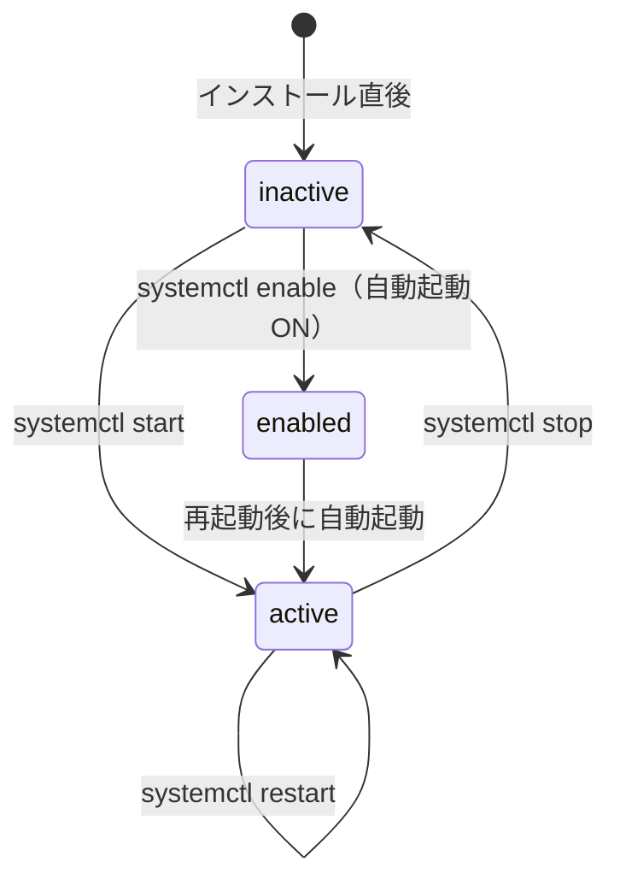

# 02. Linux 基本操作

## このセクションで学ぶこと

- Linux のファイルシステム・パーミッション・プロセス管理の基本を理解する
- `systemctl` でサービスを管理し、`journalctl` でログを読む
- `apt` でパッケージをインストール・管理する

---

## なぜ必要か

分散処理の実運用では次のような場面が毎回やってくる：

| 場面 | 必要なスキル |
|------|------------|
| Ansible がインストールしたサービスが起動しているか確認したい | systemctl / journalctl |
| Docker コンテナのログを tail したい | journalctl / docker logs |
| ディスクが足りなくなって Prometheus が止まった | df / du |
| 設定ファイルを書き換えたら壊れた | パーミッション / viの操作 |
| プロセスが暴走して CPU が 100% になった | ps / top / kill |

Linux をコマンドラインで操作する自信がないまま先に進むと、トラブルのたびに詰まる。ここで基礎を固めておく。

---

## 概念の説明

### Linux ファイルシステム階層

Linux ではすべてのファイルが `/`（ルート）を起点に1本のツリーにまとまっている。

```
/
├── etc/          設定ファイル（サービスの設定はここ）
├── var/
│   ├── log/      ログファイル
│   └── lib/      アプリのデータ（Dockerのイメージ等）
├── home/
│   └── pi/       ユーザーのホームディレクトリ（~ と表記）
├── tmp/          一時ファイル（再起動で消える）
├── usr/
│   ├── bin/      ユーザー向けコマンド（ls, grep 等）
│   └── local/    手動インストールしたもの
└── proc/         カーネルが提供する仮想ファイル（プロセス情報等）
```

### パーミッション（権限）

```
-rw-r--r--  1  pi  pi  1234  Sep 21 12:00  file.txt
│└─┬──┘└─┬─┘
│ 所有者  グループ  その他
│  rw-     r--      r--
│  読み書き 読みのみ  読みのみ
│
└── ファイルの種類（- = 通常ファイル、d = ディレクトリ）
```

数値表記：`r=4`、`w=2`、`x=1` の合計。  
例：`chmod 644 file` → 所有者: 読み書き（6）、グループ/その他: 読みのみ（4）

### systemd とサービス管理

Raspberry Pi OS Bookworm では `systemd` がプロセス管理を担っている。
サービス（常駐プロセス）は `systemctl` コマンドで操作する。



---

## ハンズオン手順

以降のコマンドはすべて **pi-master 上**（SSH 接続後）で実行する。

---

### 手順1：ファイル操作の基本

```bash
# ホームディレクトリに移動する（~ は /home/pi の短縮形）
cd ~

# 現在地を確認する
pwd
# 出力例: /home/pi

# ディレクトリを作成する
mkdir practice

# 作成したディレクトリに移動する
cd practice

# テスト用ファイルを作成する（echo で文字列をファイルに書き出す）
echo "hello distributed world" > hello.txt

# ファイルの内容を表示する
cat hello.txt

# 詳細付きでファイル一覧を表示する（パーミッション・サイズ・日時）
ls -la

# ファイルをコピーする
cp hello.txt hello-copy.txt

# ファイルを移動（リネーム）する
mv hello-copy.txt renamed.txt

# ファイルを削除する
rm renamed.txt

# 1つ上のディレクトリに戻る
cd ..

# ディレクトリごと削除する（-r: 再帰的、中身ごと削除）
rm -r practice
```

> ⚠️ `rm -r` は確認なく削除する。`rm -ri` を使うと削除前に確認が入る。`/` や `~` を間違えて指定しないよう注意。

---

### 手順2：パーミッションの確認と変更

```bash
# テスト用スクリプトを作る
echo '#!/bin/bash
echo "Hello from script"' > test.sh

# パーミッションを確認する（-rw-r--r-- = 実行権なし）
ls -la test.sh

# 所有者に実行権限を付ける
chmod u+x test.sh

# 権限が変わったことを確認する（-rwxr--r-- になる）
ls -la test.sh

# スクリプトを実行する
./test.sh

# 後片付け
rm test.sh
```

---

### 手順3：テキスト検索とパイプ

パイプ（`|`）は「あるコマンドの出力を別のコマンドに渡す」仕組み。

```bash
# /etc/os-release の内容を表示する
cat /etc/os-release

# grep で特定の行だけ抽出する（大文字小文字を無視: -i）
cat /etc/os-release | grep -i version

# ログファイルの末尾10行を表示する
tail /var/log/syslog

# ログをリアルタイムで追いかける（Ctrl+C で終了）
tail -f /var/log/syslog

# ディスク使用量を確認する（-h: 人が読みやすい単位）
df -h

# ホームディレクトリの容量内訳を確認する
du -sh ~/*
```

---

### 手順4：プロセス管理

```bash
# 実行中のプロセスを一覧表示する（スナップショット）
ps aux

# プロセスを絞り込む（例：sshd のプロセスを探す）
ps aux | grep sshd

# CPU・メモリ使用率をリアルタイム表示する（q で終了）
top

# htop をインストールして使う（より見やすい top）
sudo apt install -y htop
htop
# F10 または q で終了

# プロセス ID（PID）を指定してプロセスを終了する
# ※ 実際には不要なプロセスを kill する。ここでは確認のみ
kill -l   # シグナルの一覧
# kill <PID>       通常終了（SIGTERM）
# kill -9 <PID>    強制終了（SIGKILL）。最後の手段
```

---

### 手順5：systemd によるサービス管理

```bash
# SSH サービスの状態を確認する
sudo systemctl status ssh

# 出力例（抜粋）:
# ● ssh.service - OpenBSD Secure Shell server
#      Loaded: loaded (/lib/systemd/system/ssh.service; enabled)
#      Active: active (running) since ...

# 有効化されているサービスの一覧を表示する
systemctl list-units --type=service --state=running

# サービスを再起動する（設定変更後によく使う）
sudo systemctl restart ssh

# 起動時の自動起動を有効にする
sudo systemctl enable ssh

# 自動起動を無効にする（今は実行しない）
# sudo systemctl disable ssh
```

---

### 手順6：ログの確認（journalctl）

```bash
# システム全体の最新ログ100行を表示する
journalctl -n 100

# 特定のサービスのログを表示する
journalctl -u ssh

# 今日のログだけを表示する
journalctl --since today

# リアルタイムでログを追いかける（Ctrl+C で終了）
journalctl -f

# エラーレベル以上のログだけを表示する
journalctl -p err
```

---

### 手順7：パッケージ管理（apt）

```bash
# パッケージリストを最新に更新する（インストール前に必ず実行）
sudo apt update

# インストール可能なアップデートを確認する
apt list --upgradable 2>/dev/null | head -20

# パッケージをインストールする（-y: 確認を省略）
sudo apt install -y vim

# パッケージを検索する
apt search "text editor" | head -20

# インストール済みパッケージを確認する
dpkg -l | grep vim

# パッケージを削除する（設定ファイルは残す）
# sudo apt remove vim

# 設定ファイルごと削除する
# sudo apt purge vim

# 不要になった依存パッケージを削除する
sudo apt autoremove -y
```

---

### 手順8：vim の基本操作（最低限）

後続のステップで設定ファイルを編集する機会がある。nano でも構わないが、vim の最低限の操作を覚えておくと便利。

```bash
# テスト用ファイルを vim で開く
vim test.txt
```

vim には「ノーマルモード」と「インサートモード」がある：

| 操作 | キー | 説明 |
|------|------|------|
| 編集開始 | `i` | ノーマル → インサートモード |
| 編集終了 | `Esc` | インサート → ノーマルモード |
| 保存して終了 | `:wq` + Enter | w=write、q=quit |
| 保存せず終了 | `:q!` + Enter | 変更を破棄して終了 |
| 検索 | `/検索文字` + Enter | `n` で次の一致へ |
| 行削除 | `dd`（ノーマルモード）| 1行を削除 |
| 元に戻す | `u`（ノーマルモード）| アンドゥ |

> nano の方が直感的に使いやすい。`nano test.txt` で開き、`Ctrl+O` で保存、`Ctrl+X` で終了する。どちらを使っても構わない。

---

## 確認方法

**pi-master 上で実行：**

```bash
# OS の情報を確認する
uname -a
```

期待される出力例：
```
Linux pi-master 6.x.x-v8+ #1 SMP ... aarch64 GNU/Linux
```

```bash
# systemd のバージョンを確認する
systemctl --version | head -1
```

期待される出力例：
```
systemd 252 (252.30-1~deb12u2)
```

```bash
# apt が正常に動くことを確認する
apt list --installed 2>/dev/null | wc -l
```

期待される出力例：数百行が表示されること（環境により異なる）

```bash
# ディスクの空き容量を確認する（/ が 70% 未満なら問題なし）
df -h /
```

期待される出力例：
```
Filesystem      Size  Used Avail Use% Mounted on
/dev/mmcblk0p2   29G  2.1G   26G   8% /
```

---

## よくあるトラブルと対処

### トラブル1：`sudo` コマンドで `Permission denied` が出る

**原因：** ユーザーが `sudo` グループに属していない。

**対処：**
```bash
# 現在のユーザーが所属するグループを確認する
groups
# sudo が含まれていれば問題なし

# 含まれていない場合（root で操作する必要がある）
# Raspberry Pi OS では通常、セットアップ時のユーザーは sudo 権限を持つ
# 確認方法：
sudo cat /etc/sudoers.d/*
```

---

### トラブル2：`apt update` で GPG エラーが出る

**原因：** リポジトリの署名キーが期限切れまたは取得失敗。

**対処：**
```bash
# タイムゾーンが正しく設定されているか確認する（時刻がずれると証明書エラーになる）
timedatectl

# 正しくない場合は設定する
sudo timedatectl set-timezone Asia/Tokyo

# 再度 apt update を試みる
sudo apt update
```

---

### トラブル3：`journalctl` の出力が文字化けする

**原因：** ターミナルのエンコーディング設定が UTF-8 でない。

**対処：**
```bash
# ターミナル側（手元Mac）のエンコーディングを UTF-8 に設定する
# macOS のターミナル.app → 環境設定 → プロファイル → 詳細 → 文字エンコーディング → Unicode(UTF-8)

# 確認コマンド（pi-master 上）
echo $LANG
# ja_JP.UTF-8 または en_US.UTF-8 が出れば問題なし

# LANG が設定されていない場合
export LANG=en_US.UTF-8
```

---

### トラブル4：`tail -f` でログを見ていたら止まった

**原因：** ログローテーション（古いログを圧縮・削除する仕組み）が動いてファイルが切り替わった。

**対処：**
```bash
# -F オプション（大文字）を使うとファイルが切り替わっても追いかけ続ける
tail -F /var/log/syslog

# またはログには journalctl -f の方が確実
journalctl -f
```

---

## 演習課題

### 課題1

`/etc/` ディレクトリにある設定ファイルの数を1コマンドで数えなさい（サブディレクトリは除く）。

<details>
<summary>解答例</summary>

```bash
# pi-master 上で実行
ls /etc/ | wc -l

# -l オプションで1行に1エントリ、wc -l で行数を数える
# 出力例: 172（環境により異なる）
```

パイプ（`|`）を使って「ls の出力を wc の入力に渡す」のがポイント。

</details>

---

### 課題2

現在 pi-master で動いているサービスのうち、名前に "ssh" を含むものを探しなさい。

<details>
<summary>解答例</summary>

```bash
# pi-master 上で実行
systemctl list-units --type=service | grep ssh

# または
systemctl status ssh
```

`ssh.service` が `active (running)` であることが確認できればOK。

</details>

---

### 課題3

`/var/log/` の中で**最もファイルサイズが大きいもの**のファイル名とサイズを表示しなさい。

<details>
<summary>解答例</summary>

```bash
# pi-master 上で実行

# du でサイズ一覧を取得し、sort で降順に並べ、head で先頭1件だけ表示
sudo du -sh /var/log/* 2>/dev/null | sort -rh | head -1

# 出力例:
# 4.5M    /var/log/journal

# または ls コマンドでサイズ順にソート
sudo ls -lhS /var/log/ | head -5
```

`sort -h` はサイズの単位（K / M / G）を考慮してソートする。`-r` は逆順（大きい順）。

</details>

---

## 参考資料

- [Linux コマンドリファレンス（Debian Wiki）](https://wiki.debian.org/CommandLineInterface)（要確認）
- [systemd ドキュメント](https://www.freedesktop.org/software/systemd/man/latest/)  — systemctl・journalctl の公式リファレンス
- [Debian apt ユーザーズガイド](https://www.debian.org/doc/manuals/apt-guide/)
- [The Linux Command Line（オンライン書籍）](https://linuxcommand.org/tlcl.php) — 無料で読める英語の入門書
