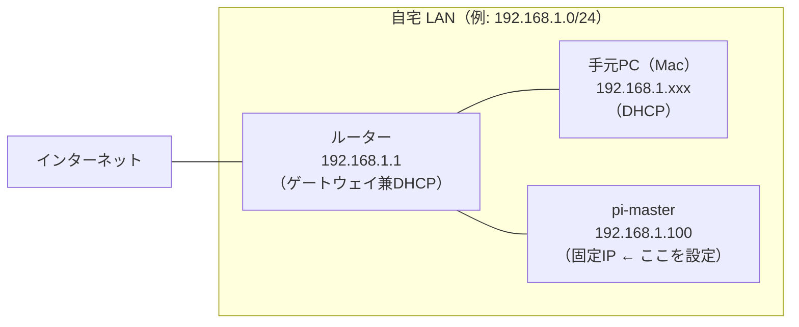
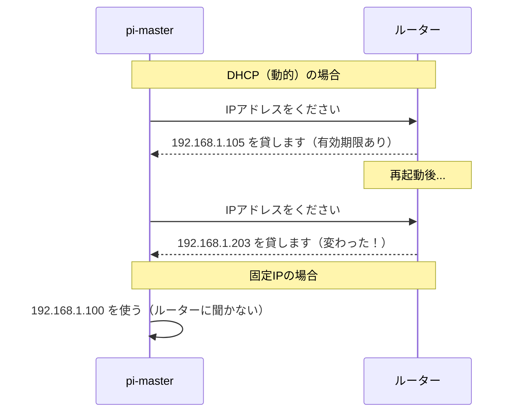

# 03. ネットワーク設定

## このセクションで学ぶこと

- IPアドレス・サブネット・ゲートウェイ・DNS の基本概念を理解する
- `nmcli` を使って有線 LAN に固定 IP アドレスを設定する
- 再起動後も設定が維持されることを確認し、`docs/hardware.md` に記録する

---

## なぜ必要か

Ansible のインベントリ（接続先リスト）には IP アドレスまたはホスト名を書く。
DHCP（動的 IP 割り当て）のままだとルーターの再起動などで IP が変わり、
**Ansible が突然つながらなくなる**。分散処理では複数ノードの IP が変わると全滅するため、
固定 IP は運用の前提条件になる。

---

## 概念の説明

### ネットワークの基本用語

| 用語 | 説明 | 例 |
|------|------|-----|
| **IP アドレス** | ネットワーク上の住所。32ビットの数値をドット区切りで表記 | `192.168.1.100` |
| **サブネットマスク** | 「同じネットワーク内」の範囲を示す。`/24` は下位8ビットがホスト部 | `255.255.255.0`（= `/24`）|
| **デフォルトゲートウェイ** | 外部ネットワーク（インターネット）への出口。通常はルーター | `192.168.1.1` |
| **DNS サーバー** | ドメイン名（`github.com` 等）を IP アドレスに変換するサーバー | `8.8.8.8`（Google）|
| **DHCP** | Dynamic Host Configuration Protocol。ルーターが IP を自動配布する仕組み |  |
| **CIDR 表記** | IP アドレスとサブネットをまとめて書く形式。`192.168.1.100/24` | |

### 自宅ネットワークの典型的な構成



### DHCP と固定 IP の違い



### NetworkManager と nmcli

Raspberry Pi OS Bookworm では **NetworkManager** がネットワーク管理を担う。
`nmcli`（NetworkManager Command Line Interface）はそれを操作するコマンド。

> ⚠️ 古いラズパイの手順で見かける `dhcpcd.conf` を編集する方法は Bookworm では使わない。
> Bookworm では `dhcpcd` はデフォルトで無効化されている。

---

## ハンズオン手順

以降のコマンドはすべて **pi-master 上**（SSH 接続後）で実行する。

---

### 手順1：現在のネットワーク状態を確認する

```bash
# IPアドレスとインターフェース一覧を表示する
ip addr show

# 出力例（抜粋）:
# 2: eth0: <BROADCAST,MULTICAST,UP,LOWER_UP> mtu 1500 ...
#     inet 192.168.1.105/24 brd 192.168.1.255 scope global dynamic eth0
# 3: wlan0: <BROADCAST,MULTICAST> mtu 1500 ...
```

**確認ポイント：**
- `eth0`：有線 LAN（これに固定 IP を設定する）
- `wlan0`：無線 LAN
- `inet 192.168.x.x/24`：現在の IP アドレス（DHCP で割り当て中）
- `dynamic` という表示が DHCP 動作中の証拠

```bash
# デフォルトゲートウェイ（ルーターのIPアドレス）を確認する
ip route show

# 出力例:
# default via 192.168.1.1 dev eth0 proto dhcp ...
# → ゲートウェイは 192.168.1.1 とわかる
```

```bash
# DNS サーバーを確認する
resolvectl status | grep "DNS Servers"

# 出力例:
# DNS Servers: 192.168.1.1
```

---

### 手順2：NetworkManager の接続名を確認する

固定 IP 設定は「接続プロファイル」に対して行う。まず接続名を調べる。

```bash
# 接続プロファイルの一覧を表示する
nmcli connection show

# 出力例:
# NAME                UUID                                  TYPE      DEVICE
# Wired connection 1  xxxxxxxx-xxxx-xxxx-xxxx-xxxxxxxxxxxx  ethernet  eth0
# lo                  xxxxxxxx-xxxx-xxxx-xxxx-xxxxxxxxxxxx  loopback  lo
```

有線 LAN の接続名（`NAME` 列）を確認する。以降の手順では `"Wired connection 1"` を使う。
**実際の名前が異なる場合は適宜置き換えること。**

---

### 手順3：固定 IP を設定する前の準備

設定に必要な情報を手元に揃える。手順1で確認した値を使う。

| 情報 | 確認方法 | 例 |
|------|---------|-----|
| 現在の IP アドレス | `ip addr show eth0` | `192.168.1.105` |
| サブネット | `/24` なら `255.255.255.0` | `/24` |
| ゲートウェイ | `ip route show` の `default via` | `192.168.1.1` |
| 設定したい固定 IP | ゲートウェイの最後の数字を変えて選ぶ | `192.168.1.100` |

**固定 IP を選ぶときの注意：**
- ルーターの DHCP 配布範囲外の番号を選ぶ（通常は `.2` 〜 `.99` や `.200` 〜 `.254` が安全）
- ルーターの管理画面で DHCP 範囲を確認できる
- 他の機器が使っていない番号を選ぶ（`ping 192.168.1.100` で応答がないことを確認）

```bash
# 使いたい IP アドレスが空いているか確認する（応答がなければ使用可能）
ping -c 3 192.168.1.100
# "Destination Host Unreachable" または Request timeout であれば使用可能
```

---

### 手順4：nmcli で固定 IP を設定する

> ⚠️ **事前確認：** SSH で接続中に IP を変更すると接続が切れる。
> 設定後の IP アドレスで再接続できるよう、新しい IP をメモしておくこと。

```bash
# 以下のコマンドを1行ずつ実行する
# ※ 192.168.1.100、192.168.1.1 は自分の環境の値に置き換える

# IPv4 を手動設定（固定IP）に変更する
sudo nmcli connection modify "Wired connection 1" \
  ipv4.method manual \
  ipv4.addresses "192.168.1.100/24" \
  ipv4.gateway "192.168.1.1" \
  ipv4.dns "8.8.8.8,8.8.4.4"

# 設定を反映させる（一時的に接続が切れる）
sudo nmcli connection down "Wired connection 1"
sudo nmcli connection up "Wired connection 1"
```

接続が切れた場合は、新しい IP アドレスで再接続する：

```bash
# 手元Mac のターミナルで実行
ssh pi@192.168.1.100
```

---

### 手順5：設定を確認する

**pi-master 上で実行：**

```bash
# 新しい IP アドレスが設定されているか確認する
ip addr show eth0

# 出力例（dynamic の表示が消え、固定IPになっている）:
# inet 192.168.1.100/24 brd 192.168.1.255 scope global eth0
#                                                    ← dynamic の表示がなくなる

# ゲートウェイを確認する
ip route show | grep default

# DNS が引けることを確認する
ping -c 3 8.8.8.8       # IP で疎通確認
ping -c 3 github.com    # DNS 経由で名前解決確認
```

---

### 手順6：再起動して設定が維持されるか確認する

```bash
# pi-master を再起動する
sudo reboot
```

1〜2分待ってから再接続する：

```bash
# 手元Mac のターミナルで実行
ssh pi@192.168.1.100

# 接続後、IP を確認する
ip addr show eth0
# → 固定 IP が維持されていれば完了
```

---

### 手順7：docs/hardware.md に IP アドレスを記録する

このリポジトリを手元Mac でクローンしているか、または pi-master 上で直接編集して、
`docs/hardware.md` の「要記入」箇所に実際の IP アドレスを記入する。

```bash
# 手元Mac のターミナルで実行
# リポジトリのディレクトリに移動して編集する
# （このリポジトリを Mac にクローンしている場合）
vi docs/hardware.md
# または
code docs/hardware.md  # VS Code を使う場合
```

ノード一覧の `pi-master` 行と、ネットワークセクションの「要記入」欄を更新する。

---

## 確認方法

**pi-master 上で実行：**

```bash
# 1. 固定 IP で設定されていることを確認する（dynamic の表示がないこと）
ip addr show eth0 | grep inet
```

期待される出力：
```
    inet 192.168.1.100/24 brd 192.168.1.255 scope global eth0
```
(`dynamic` という文字が**ない**ことを確認）

```bash
# 2. インターネットへの疎通を確認する
ping -c 3 8.8.8.8
```

期待される出力（抜粋）：
```
3 packets transmitted, 3 received, 0% packet loss
```

```bash
# 3. DNS 解決が正常に動作することを確認する
ping -c 2 github.com
```

期待される出力（抜粋）：
```
PING github.com (xxx.xxx.xxx.xxx) ...
2 packets transmitted, 2 received, 0% packet loss
```

```bash
# 4. NetworkManager の接続状態を確認する
nmcli connection show "Wired connection 1" | grep ipv4
```

期待される出力（抜粋）：
```
ipv4.method:        manual
ipv4.addresses:     192.168.1.100/24
ipv4.gateway:       192.168.1.1
ipv4.dns:           8.8.8.8,8.8.4.4
```

---

## よくあるトラブルと対処

### トラブル1：固定 IP 設定後に SSH 接続が切れ、再接続できない

**原因：** 設定した IP が他の機器と競合している、またはゲートウェイが間違っている。

**対処：**
```bash
# ラズパイにモニターとキーボードを接続して直接ログインする
# または、ルーターの管理画面でラズパイの現在の IP を確認して接続

# DHCP に戻して状態をリセットする
sudo nmcli connection modify "Wired connection 1" ipv4.method auto
sudo nmcli connection modify "Wired connection 1" ipv4.addresses "" ipv4.gateway "" ipv4.dns ""
sudo nmcli connection down "Wired connection 1"
sudo nmcli connection up "Wired connection 1"

# DHCP で取得した IP を確認して、固定 IP の設定をやり直す
ip addr show eth0
```

---

### トラブル2：固定 IP を設定したが DNS が引けない（ping 8.8.8.8 は通るのに）

**原因：** DNS サーバーの設定が反映されていない。

**対処：**
```bash
# DNS の設定を確認する
resolvectl status

# nmcli の DNS 設定を確認する
nmcli connection show "Wired connection 1" | grep dns

# 設定が空の場合は再設定する
sudo nmcli connection modify "Wired connection 1" ipv4.dns "8.8.8.8,8.8.4.4"
sudo nmcli connection up "Wired connection 1"

# 手動でDNSを確認（nslookup でテスト）
nslookup github.com 8.8.8.8
```

---

### トラブル3：nmcli の接続名が "Wired connection 1" と異なる

**原因：** セットアップ方法や OS のバージョンによって接続名が異なる場合がある。

**対処：**
```bash
# 有線 LAN の接続名を確認する
nmcli connection show | grep ethernet

# 接続名に空白があってもシングルクォートで囲めば動く
nmcli connection show 'Wired connection 1'

# 接続名の代わりにデバイス名（eth0）を指定することもできる
sudo nmcli connection modify eth0 ipv4.method manual ...
# ただしデバイス名での変更は接続プロファイルが存在する場合のみ動作する
```

---

### トラブル4：`ping github.com` は通るが `ssh github.com` がタイムアウトする

**原因：** ファイアウォールまたはルーターが SSH ポート（22番）をブロックしている（会社・学校のネットワーク等）。

**対処：**
```bash
# ポートの疎通を確認する
# （nc: netcat。インストールされていない場合は sudo apt install -y netcat-openbsd）
nc -zv github.com 22
nc -zv github.com 443

# 443 番が通る場合は、SSH の接続先ポートを 443 に変更する設定が必要
# → ~/.ssh/config で Host github.com の Port を 443 に設定する（04-ssh.md で扱う）
```

---

## 演習課題

### 課題1

現在の pi-master のネットワーク設定（IP・ゲートウェイ・DNS）を1コマンドでまとめて表示しなさい。

<details>
<summary>解答例</summary>

```bash
# pi-master 上で実行

# ip コマンドで IPv4 の設定をまとめて表示する
ip -4 addr && ip -4 route

# または nmcli で接続の詳細を表示する
nmcli -f ipv4.addresses,ipv4.gateway,ipv4.dns connection show "Wired connection 1"
```

</details>

---

### 課題2

同じ LAN 上にある**すべての機器の IP アドレス**を調べなさい。
（ルーターの管理画面を使わずに、コマンドラインだけで。）

<details>
<summary>解答例</summary>

```bash
# pi-master 上で実行

# nmap をインストールする（ネットワークスキャナー）
sudo apt install -y nmap

# LAN 全体をスキャンする（例: 192.168.1.0/24）
# ※ 自分のサブネットに合わせてアドレスを変える
sudo nmap -sn 192.168.1.0/24

# 出力例:
# Nmap scan report for 192.168.1.1   (ルーター)
# Nmap scan report for 192.168.1.10  (Mac)
# Nmap scan report for 192.168.1.100 (pi-master)
```

`-sn` はポートスキャンを省略して「生きているホスト」だけを探す（Ping スキャン）。
セキュリティ上、自分が管理するネットワーク以外には使わないこと。

</details>

---

### 課題3

固定 IP を設定した `pi-master` に、手元 Mac の `~/.ssh/config` に設定を追加して
`ssh pi-master` の短縮形だけで接続できるようにしなさい（IP アドレスを打たずに）。

<details>
<summary>解答例</summary>

```bash
# 手元Mac のターミナルで実行

# ~/.ssh/config を編集する（なければ作成される）
cat >> ~/.ssh/config << 'EOF'

Host pi-master
    HostName 192.168.1.100
    User pi
    IdentityFile ~/.ssh/id_ed25519
EOF

# 正しく設定できたか確認する
ssh pi-master hostname
# 出力: pi-master
```

`~/.ssh/config` の詳細な設定は次の `04-ssh.md` で扱う。

</details>

---

## 参考資料

- [NetworkManager の公式ドキュメント（nmcli）](https://networkmanager.dev/docs/api/latest/nmcli.html)
- [Raspberry Pi 公式ドキュメント：ネットワーク設定](https://www.raspberrypi.com/documentation/computers/configuration.html#networking)
- [ip コマンドリファレンス（iproute2）](https://man7.org/linux/man-pages/man8/ip.8.html)
