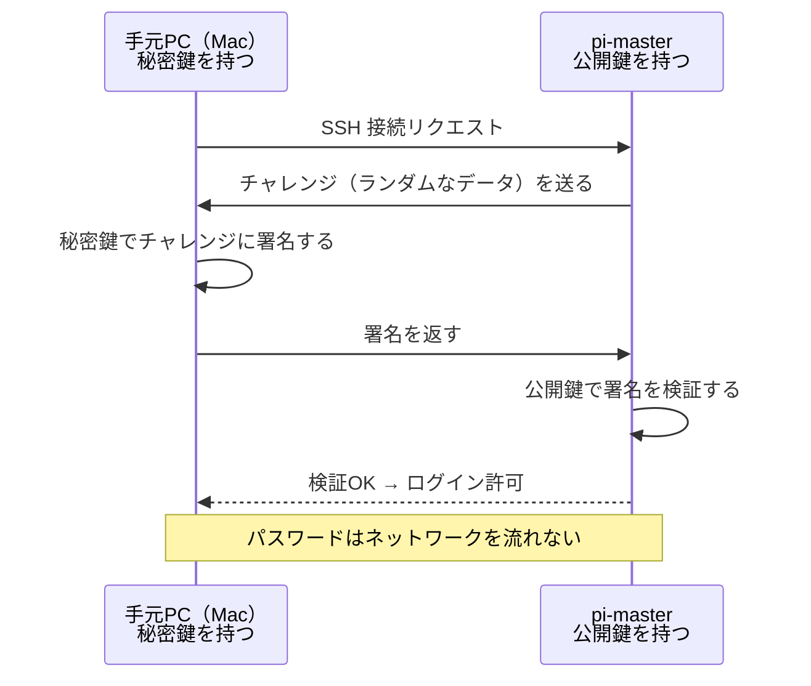

# 04. SSH 設定

## このセクションで学ぶこと

- 公開鍵認証の仕組みを理解し、鍵の管理を整える
- `~/.ssh/config` で接続を簡略化し、複数ノードに素早く接続できるようにする
- パスワード認証を無効化してセキュリティを高める

---

## なぜ必要か

Ansible はすべての操作を SSH 経由で行う。SSH の設定が雑だと：

- Playbook 実行のたびにパスワードを聞かれる（自動化できない）
- 接続先ノードが増えるたびに IP アドレスを打ち間違える
- パスワード認証が有効なままだとブルートフォース攻撃のリスクがある

`~/.ssh/config` を整備すれば、`ssh pi-master` の一言で接続でき、
Ansible もこの設定を自動的に参照する。
パスワード認証の無効化はラズパイをインターネットに公開するかどうかにかかわらず、
良い習慣として身につけておく。

---

## 概念の説明

### 公開鍵認証の仕組み

パスワード認証は「合言葉」を毎回ネットワーク越しに送る。
公開鍵認証は「合言葉を知らなくても、数学的に証明できる」仕組み。



### 鍵ファイルの場所

```
~/.ssh/                          （パーミッション: 700）
├── id_ed25519                   秘密鍵（絶対に外に出さない）
├── id_ed25519.pub               公開鍵（サーバーに登録する）
├── authorized_keys              このサーバーへの接続を許可する公開鍵リスト
├── known_hosts                  接続したことがあるサーバーの指紋リスト
└── config                       接続先のエイリアス設定
```

### ~/.ssh/config の構造

```
Host <エイリアス名>
    HostName     <接続先のIPまたはドメイン>
    User         <ログインユーザー名>
    IdentityFile <使用する秘密鍵のパス>
    <その他オプション>
```

---

## ハンズオン手順

---

### 手順1：現在の鍵の状態を確認する（手元Mac）

**実行マシン：手元PC（Mac）**

```bash
# 鍵ファイルの存在とパーミッションを確認する
ls -la ~/.ssh/

# 期待される出力:
# drwx------  ...  .ssh/                ← 700 (自分だけ読み書き実行可)
# -rw-------  ...  id_ed25519           ← 600 (自分だけ読み書き可)
# -rw-r--r--  ...  id_ed25519.pub       ← 644 (公開鍵は読み取り可)
# -rw-r--r--  ...  known_hosts

# 公開鍵の内容を確認する
cat ~/.ssh/id_ed25519.pub
# 出力例: ssh-ed25519 AAAA... user@mac
```

鍵がない場合は01-hardware-os.md の手順3を参照して作成する。

---

### 手順2：pi-master に公開鍵が登録されているか確認する

**実行マシン：pi-master（SSH 接続後）**

```bash
# authorized_keys ファイルを確認する
cat ~/.ssh/authorized_keys

# Mac の公開鍵（id_ed25519.pub の内容）と一致する行があればOK
# パーミッションも確認する
ls -la ~/.ssh/
# drwx------ （700）
# -rw------- authorized_keys （600）
```

公開鍵が登録されていない場合：

```bash
# 手元Mac のターミナルで実行
# ssh-copy-id を使って公開鍵を登録する
ssh-copy-id -i ~/.ssh/id_ed25519.pub pi@192.168.1.100
```

---

### 手順3：~/.ssh/config を設定する（手元Mac）

**実行マシン：手元PC（Mac）**

```bash
# ~/.ssh/config を作成・編集する
# ファイルがなければ新規作成される
vi ~/.ssh/config
# または
nano ~/.ssh/config
```

以下の内容を書き込む（IP は自分の環境に合わせる）：

```
# pi-master への接続設定
Host pi-master
    HostName 192.168.1.100
    User pi
    IdentityFile ~/.ssh/id_ed25519
    ServerAliveInterval 60
    ServerAliveCountMax 3
```

各オプションの説明：

| オプション | 意味 |
|-----------|------|
| `Host` | このブロックのエイリアス名。`ssh pi-master` で参照される |
| `HostName` | 実際の接続先 IP またはドメイン |
| `User` | ログインするユーザー名 |
| `IdentityFile` | 使用する秘密鍵のパス |
| `ServerAliveInterval 60` | 60秒ごとに死活確認を送る（接続が切れにくくなる）|
| `ServerAliveCountMax 3` | 3回応答がなければ接続を切る |

```bash
# config ファイルのパーミッションを設定する（他人が読めない状態にする）
chmod 600 ~/.ssh/config

# 設定を確認する
cat ~/.ssh/config
```

---

### 手順4：エイリアスで接続できることを確認する（手元Mac）

**実行マシン：手元PC（Mac）**

```bash
# エイリアスで接続する（IP アドレスを打たなくてよい）
ssh pi-master

# 接続に成功したら hostname コマンドで確認して終了する
hostname
# 出力: pi-master
exit
```

```bash
# コマンド実行もエイリアスで使えることを確認する
ssh pi-master uptime
# 出力例: 12:34:56 up 1:23, 1 user, load average: 0.05, 0.02, 0.01
```

---

### 手順5：SSH エージェントを設定する（手元Mac）

**実行マシン：手元PC（Mac）**

SSH エージェント（ssh-agent）は秘密鍵をメモリに保持して、接続のたびにパスフレーズを入力しなくて済むようにするプロセス。

```bash
# エージェントが動いているか確認する
echo $SSH_AUTH_SOCK
# パスが表示されれば起動中

# 秘密鍵をエージェントに追加する
ssh-add ~/.ssh/id_ed25519
# パスフレーズを設定している場合はここで1回だけ入力する

# 登録されている鍵を確認する
ssh-add -l
# 出力例: 256 SHA256:xxx... user@mac (ED25519)
```

macOS では鍵チェーンと連携させると OS ログイン後は一度も入力しなくて済む：

```bash
# macOS の Keychain と連携させる（~/.ssh/config に追加）
# 先ほどの pi-master の設定ブロックを開いて以下を追記する
vi ~/.ssh/config
```

```
Host pi-master
    HostName 192.168.1.100
    User pi
    IdentityFile ~/.ssh/id_ed25519
    ServerAliveInterval 60
    ServerAliveCountMax 3
    UseKeychain yes       ← macOS 専用: Keychain に保存
    AddKeysToAgent yes    ← 起動時に自動でエージェントに追加
```

---

### 手順6：sshd_config を強化する（pi-master）

> ⚠️ **破壊的操作の注意：** パスワード認証を無効にすると、鍵認証に失敗した場合に**一切ログインできなくなる**。
> **必ず手順6-Aで鍵認証が動作することを確認してから**、この手順を実行すること。

**事前確認（手順6-A）：** 別のターミナルウィンドウで鍵認証が通ることを確認しておく。

```bash
# 手元Mac の別ウィンドウで実行
# 設定変更中もこのウィンドウでセッションを維持しておく
ssh pi-master
# ← このウィンドウはそのまま開いておく
```

**戻し方（もし設定を間違えた場合）：**
```bash
# Raspberry Pi に直接モニターとキーボードを接続してログインし、
# /etc/ssh/sshd_config の PasswordAuthentication の行を no から yes に戻して
# sudo systemctl restart ssh
```

---

**実行マシン：pi-master（SSH 接続後）**

```bash
# sshd_config のバックアップを取る（変更前の状態を保存）
sudo cp /etc/ssh/sshd_config /etc/ssh/sshd_config.bak

# 現在の設定を確認する
grep -E "^(PasswordAuthentication|PermitRootLogin|PubkeyAuthentication)" /etc/ssh/sshd_config
```

```bash
# 設定ファイルを編集する
sudo nano /etc/ssh/sshd_config
```

以下の項目を確認・変更する：

```
# 変更前 → 変更後

PubkeyAuthentication yes        # ← yes になっていることを確認（デフォルト）
PasswordAuthentication no       # ← yes を no に変更
PermitRootLogin no              # ← prohibit-password を no に変更（ルートログイン禁止）
```

> `#` で始まる行はコメント（無効）。コメントアウトされている場合は行頭の `#` を外してから値を変更する。

```bash
# 設定の文法チェックをする（エラーがなければ何も表示されない）
sudo sshd -t

# SSH サービスを再起動して設定を反映させる
sudo systemctl restart ssh

# SSH サービスが正常に再起動されたことを確認する
sudo systemctl status ssh | head -5
```

---

### 手順7：設定変更後の動作確認（手元Mac）

**実行マシン：手元PC（Mac）**

```bash
# 鍵認証でログインできることを確認する
ssh pi-master echo "鍵認証OK"

# パスワード認証が拒否されることを確認する
ssh -o PubkeyAuthentication=no pi@192.168.1.100
# 期待される結果: Permission denied (publickey)
# ← パスワードを聞かれずに拒否されればOK
```

---

### 【補足】SSH ポートフォワーディング（ステージ08の予習）

ステージ08 で Grafana（ポート 3000）をブラウザで確認するときに使う。

```bash
# 手元Mac のターミナルで実行
# pi-master の 3000 番ポートを Mac の 3000 番ポートにトンネルする
ssh -L 3000:localhost:3000 pi-master

# このターミナルを開いたまま、Mac のブラウザで以下にアクセスする
# http://localhost:3000  → pi-master の Grafana が開く
```

---

## 確認方法

**手元Mac のターミナルで実行：**

```bash
# 1. エイリアスで接続できることを確認する
ssh pi-master hostname
```

期待される出力：
```
pi-master
```

```bash
# 2. パスワードなしで接続できることを確認する（エージェント使用）
ssh -o BatchMode=yes pi-master echo "OK"
```

期待される出力：
```
OK
```

（`BatchMode=yes` は「パスワードやパスフレーズを聞かれたらエラーにする」オプション。Ansible もこのモードで動く。）

```bash
# 3. パスワード認証が無効になっていることを確認する
ssh -o PubkeyAuthentication=no pi@192.168.1.100 2>&1
```

期待される出力：
```
pi@192.168.1.100: Permission denied (publickey).
```

```bash
# 4. sshd の設定を確認する（pi-master 上で実行）
sudo sshd -T | grep -E "(passwordauth|pubkeyauth|permitroot)"
```

期待される出力：
```
pubkeyauthentication yes
passwordauthentication no
permitrootlogin no
```

---

## よくあるトラブルと対処

### トラブル1：`~/.ssh/config` を設定したのに `ssh pi-master` でパスワードを聞かれる

**原因A：** config ファイルのパーミッションが広すぎる（644 以上）と SSH が無視する。  
**対処A：**
```bash
# パーミッションを修正する
chmod 600 ~/.ssh/config
# 再度 ssh pi-master を試みる
```

**原因B：** `IdentityFile` に指定した秘密鍵がエージェントに登録されていない。  
**対処B：**
```bash
ssh-add ~/.ssh/id_ed25519
ssh pi-master
```

---

### トラブル2：`sshd` 再起動後に接続できなくなった

**原因：** sshd_config の書き方を間違え、サービスが起動しない状態になった。

**対処（既存セッションが残っている場合）：**
```bash
# pi-master の既存 SSH セッション上で実行
# バックアップから復元する
sudo cp /etc/ssh/sshd_config.bak /etc/ssh/sshd_config
sudo systemctl restart ssh
```

**対処（セッションが残っていない場合）：**
Raspberry Pi に HDMI モニターとキーボードを接続してログインし、上記の復元手順を実行する。

---

### トラブル3：`known_hosts` の警告が出て接続できない

**原因：** OS の再インストール等でサーバーの鍵が変わった。

**対処：**
```bash
# 手元Mac で古いエントリを削除する
ssh-keygen -R pi-master
ssh-keygen -R 192.168.1.100

# 再接続する（初回は指紋確認が出る。yes で承認）
ssh pi-master
```

---

### トラブル4：`ssh-add` でパスフレーズを入力したのに次回ターミナル起動時に忘れている

**原因：** macOS の Keychain 連携が設定されていない。

**対処：**
```bash
# ~/.ssh/config に以下を追記する（全 Host ブロックに効かせる場合は Host * に書く）
cat >> ~/.ssh/config << 'EOF'

Host *
    UseKeychain yes
    AddKeysToAgent yes
EOF

# 手動でキーチェーンに追加する
ssh-add --apple-use-keychain ~/.ssh/id_ed25519
```

---

## 演習課題

### 課題1

pi-master の SSH サーバーが使っているホスト鍵の種類と fingerprint を確認しなさい。
（接続先が本物かどうかを確認する「サーバー側の指紋」）

<details>
<summary>解答例</summary>

```bash
# pi-master 上で実行
# サーバーのホスト公開鍵の fingerprint を表示する
ssh-keygen -lf /etc/ssh/ssh_host_ed25519_key.pub

# 出力例:
# 256 SHA256:xxxxxx... root@pi-master (ED25519)

# 接続時に表示される fingerprint と一致するか確認できる
# 手元Mac での初回接続時に表示された fingerprint と同じ値のはず

# 全種類の鍵を確認する
for key in /etc/ssh/ssh_host_*_key.pub; do
    ssh-keygen -lf "$key"
done
```

</details>

---

### 課題2

`~/.ssh/config` を使わずに、1コマンドで次の条件を満たす SSH 接続を確立しなさい：
「ポートフォワード（ローカル 8080 → pi-master の 80）を有効にしてバックグラウンドで接続」

<details>
<summary>解答例</summary>

```bash
# 手元Mac で実行
# -L: ローカルポートフォワーディング
# -N: リモートコマンドを実行しない（フォワードのみ）
# -f: バックグラウンドで実行
ssh -L 8080:localhost:80 -N -f pi@192.168.1.100

# バックグラウンドで動いているか確認する
ps aux | grep ssh

# 接続を終了する（PID を調べて kill）
kill $(pgrep -f "ssh -L 8080")
```

`-N -f` の組み合わせはポートフォワードを使いたいだけで、コマンドは実行しない場合によく使う。
ステージ08 の Grafana アクセスで同様のパターンを使う。

</details>

---

### 課題3

pi-master で SSH ログインを試みた記録（成功・失敗）をすべて表示しなさい。

<details>
<summary>解答例</summary>

```bash
# pi-master 上で実行

# journalctl で ssh サービスのログを確認する
journalctl -u ssh --since today

# ログイン成功の記録だけ抽出する
journalctl -u ssh | grep "Accepted"

# ログイン失敗の記録だけ抽出する
journalctl -u ssh | grep "Failed\|Invalid"

# /var/log/auth.log で確認する方法もある
sudo grep "sshd" /var/log/auth.log | tail -20
```

公開鍵認証に失敗した記録がないことを確認しておくと、
設定ミスによる自分のロックアウトが起きていないことがわかる。

</details>

---

## 参考資料

- [OpenSSH 公式マニュアル（ssh_config）](https://man.openbsd.org/ssh_config)
- [OpenSSH 公式マニュアル（sshd_config）](https://man.openbsd.org/sshd_config)
- [Raspberry Pi 公式ドキュメント：リモートアクセス](https://www.raspberrypi.com/documentation/computers/remote-access.html)
