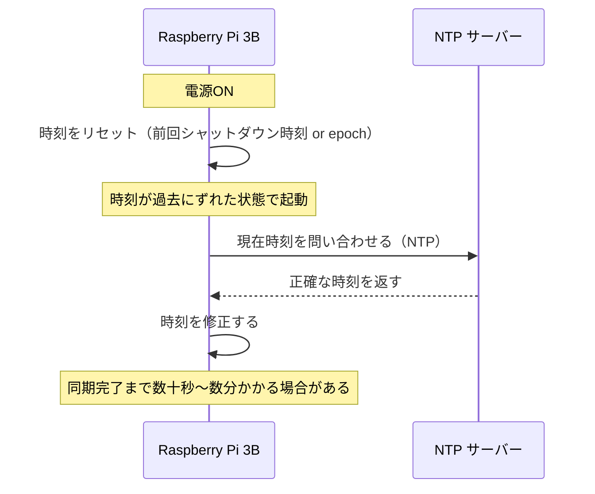
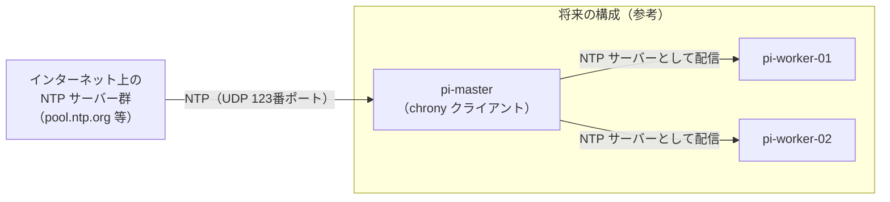

# 05. 時刻同期（chrony）

## このセクションで学ぶこと

- 分散システムで時刻のずれが何を引き起こすかを理解する
- chrony をインストールし、NTP で時刻を同期させる
- `chronyc` と `timedatectl` で同期状態を確認する

---

## なぜ必要か

時刻同期は「地味だが欠かせない」インフラ設定の代表例。ずれると次のような問題が起きる：

| 問題 | 具体的な症状 |
|------|------------|
| **ログの順序が狂う** | pi-master と pi-worker のログをまとめて見たとき、後に起きた出来事が先に表示される |
| **TLS 証明書の検証失敗** | `apt update` や `docker pull` が "certificate not yet valid" エラーで止まる |
| **分散合意アルゴリズムの誤動作** | Raft（ステージ6）などは各ノードの時刻が近いことを前提とする |
| **ファイルのタイムスタンプ混乱** | `make` が「変更されていない」と判断してビルドをスキップする |

特に **Raspberry Pi 3B にはハードウェア RTC（リアルタイムクロック）が搭載されていない**。
電源を切ると時計がリセットされるため、起動後の早期 NTP 同期が必須になる。

---

## 概念の説明

### RTC がないとどうなるか



### NTP と chrony

**NTP（Network Time Protocol）**：ネットワーク越しに正確な時刻を取得するプロトコル。  
**chrony**：NTP の実装の一つ。次の点で標準の `systemd-timesyncd` より優れている：

| 比較項目 | systemd-timesyncd | chrony |
|---------|------------------|--------|
| 起動直後の大きなズレの修正 | 遅い（段階的に修正）| 速い（`makestep` で一気に修正）|
| 精度 | 標準的 | 高い |
| 将来の NTP サーバー化 | 不可 | 可（ワーカーノードへの配信に使える）|
| 設定の柔軟性 | 低い | 高い |

Raspberry Pi OS Bookworm では `systemd-timesyncd` がデフォルトで動いているが、
ステージ6で Ansible による自動設定に組み込むため、ここで chrony に統一する。

### 時刻同期の仕組み



---

## ハンズオン手順

以降のコマンドはすべて **pi-master 上**（SSH 接続後）で実行する。

---

### 手順1：現在の時刻同期状態を確認する

```bash
# システムの時刻と同期状態を確認する
timedatectl

# 出力例:
#                Local time: Sun 2026-09-21 12:34:56 JST
#            Universal time: Sun 2026-09-21 03:34:56 UTC
#                  RTC time: n/a                         ← RTC なし
#                 Time zone: Asia/Tokyo (JST, +0900)
# System clock synchronized: yes
#               NTP service: active
#           RTC in local TZ: no
```

`RTC time: n/a` は Pi 3B にハードウェア時計がないことを示す。正常。

```bash
# 現在動いている NTP クライアントを確認する
systemctl status systemd-timesyncd
# active (running) なら systemd-timesyncd が動いている
```

---

### 手順2：タイムゾーンが正しく設定されているか確認する

```bash
# タイムゾーンを確認する
timedatectl | grep "Time zone"

# Asia/Tokyo になっていない場合は設定する
sudo timedatectl set-timezone Asia/Tokyo

# 確認する
date
# 出力例: Sun Sep 21 12:34:56 JST 2026
```

---

### 手順3：systemd-timesyncd を停止して chrony をインストールする

```bash
# systemd-timesyncd を無効化する（chrony と競合するため）
sudo systemctl stop systemd-timesyncd
sudo systemctl disable systemd-timesyncd

# パッケージリストを更新して chrony をインストールする
sudo apt update
sudo apt install -y chrony

# インストール後、chrony が自動起動しているか確認する
sudo systemctl status chrony
# active (running) が表示されればOK
```

---

### 手順4：chrony の設定を確認・調整する

```bash
# 設定ファイルを確認する
cat /etc/chrony/chrony.conf
```

Raspberry Pi OS Bookworm のデフォルト設定（主要部分）：

```
# NTP サーバーのプール（Debian のプールを使用）
pool 2.debian.pool.ntp.org iburst maxsources 4

# 起動直後に大きなズレを一気に修正する設定（RTC なしの Pi に重要）
makestep 1.0 3

# ドリフト（時計の進み/遅れ率）を保存するファイル
driftfile /var/lib/chrony/chrony.drift
```

**日本のNTPサーバーに変更する場合（任意）：**

```bash
# 設定ファイルを編集する
sudo nano /etc/chrony/chrony.conf

# pool 行を以下に置き換える（より低レイテンシで同期できる）
# pool ntp.nict.jp iburst maxsources 4
```

> ⚠️ 要検証：`ntp.nict.jp`（情報通信研究機構）は日本の公式 NTP サーバー。
> ただしアクセス集中時に応答が遅い場合があるため、デフォルトの `debian.pool.ntp.org` でも十分実用的。

設定を変更した場合は chrony を再起動する：

```bash
sudo systemctl restart chrony
```

---

### 手順5：時刻同期の状態を確認する

```bash
# 同期元サーバーの一覧と状態を表示する
chronyc sources -v
```

出力例の見方：

```
  .-- Source mode  '^' = server, '=' = peer, '#' = local clock.
 / .- Source state '*' = current best, '+' = combined, '-' = not combined,
| / .- Last sample               [ ...]
|/ /                             [ms]
MS Name/IP address  Stratum Poll Reach LastRx Last sample
======================================================================================
^* ntp1.example.com       2   6   377    45   +1234us[+1234us] +/-   20ms
^+ ntp2.example.com       2   6   377    46   +2345us[+2345us] +/-   25ms
```

**重要な列：**

| 記号/列 | 意味 |
|---------|------|
| `*` | 現在メインで使用中のサーバー |
| `+` | サブで使用中（組み合わせに利用）|
| `Stratum` | NTP の階層（1が原子時計に直結、数字が小さいほど正確）|
| `Reach` | 直近8回の通信成功率（377 = 2進数 11111111 = 8/8 成功）|
| `Last sample` | 最後の同期での時刻のずれ |

```bash
# 追跡状態の詳細を表示する
chronyc tracking
```

出力例：

```
Reference ID    : xxxx (ntp1.example.com)
Stratum         : 3
Ref time (UTC)  : Sun Sep 21 03:34:56 2026
System time     : 0.000123456 seconds fast of NTP time  ← ずれ量
Last offset     : +0.000012345 seconds
RMS offset      : 0.000034567 seconds
Frequency       : 12.345 ppm fast                        ← ドリフト率
Residual freq   : +0.001 ppm
Skew            : 0.234 ppm
Root delay      : 0.012345678 seconds
Root dispersion : 0.001234567 seconds
Update interval : 64.2 seconds
Leap status     : Normal
```

**System time の値が ±1秒以内であれば正常に同期されている。**

---

## 確認方法

**pi-master 上で実行：**

```bash
# 1. chrony が起動していることを確認する
systemctl is-active chrony
```

期待される出力：
```
active
```

```bash
# 2. 時刻が同期されていることを確認する
timedatectl | grep synchronized
```

期待される出力：
```
System clock synchronized: yes
```

```bash
# 3. 同期元が見つかっていることを確認する（* が付いたサーバーがあること）
chronyc sources | grep '^\^*'
```

期待される出力（例）：
```
^* ntp1.example.com    2   6   377    45   +1234us ...
```

```bash
# 4. 時刻のずれが小さいことを確認する
chronyc tracking | grep "System time"
```

期待される出力例（±1秒以内であればOK）：
```
System time     : 0.000345678 seconds fast of NTP time
```

---

## よくあるトラブルと対処

### トラブル1：`chronyc sources` に `^?` が表示されてサーバーと通信できない

**原因：** NTP サーバーへの UDP 123番ポートがブロックされているか、DNS 解決に失敗している。

**対処：**
```bash
# DNS が引けているか確認する
ping -c 2 2.debian.pool.ntp.org

# UDP ポートでの疎通を確認する
# （chronyc はここでは直接確認できないが、tcpdump で見ることができる）
sudo tcpdump -n port 123 &
sleep 5
sudo chronyc burst 4/4
sleep 5
kill %1

# 代替の NTP サーバーを試す
sudo nano /etc/chrony/chrony.conf
# pool 行を以下に変更する
# server time.cloudflare.com iburst
sudo systemctl restart chrony
```

---

### トラブル2：起動直後、しばらく時刻が大幅にずれたままになる

**原因：** `makestep` の設定がないか、起動直後に NTP サーバーへ到達できていない。

**対処：**
```bash
# makestep の設定があるか確認する
grep makestep /etc/chrony/chrony.conf
# 出力例: makestep 1.0 3

# なければ追加する（起動後3回までは1秒以上のズレを即座に修正）
echo "makestep 1.0 3" | sudo tee -a /etc/chrony/chrony.conf
sudo systemctl restart chrony

# 手動で強制的に時刻を同期させることもできる
sudo chronyc makestep
```

---

### トラブル3：`timedatectl` で `NTP service: inactive` と表示される

**原因：** systemd-timesyncd を停止したが chrony がうまく引き継げていない、
または chrony が起動していない。

**対処：**
```bash
# chrony の状態を詳しく確認する
sudo systemctl status chrony

# エラーログを確認する
journalctl -u chrony -n 30

# chrony を再起動する
sudo systemctl restart chrony

# timedatectl の NTP は systemd-timesyncd の状態を示す場合がある。
# chrony が動いていれば NTP 同期は機能している
chronyc tracking | grep "Reference ID"
# Reference ID が 0.0.0.0 以外ならば同期中
```

---

## 演習課題

### 課題1

pi-master の時刻が NTP サーバーと何ミリ秒ずれているかを確認し、
「許容範囲（±100ms 以内）かどうか」を判定するワンライナーを書きなさい。

<details>
<summary>解答例</summary>

```bash
# pi-master 上で実行

# System time のずれを秒単位で取得し、ミリ秒に変換して表示する
offset=$(chronyc tracking | grep "System time" | awk '{print $3}')
echo "時刻のずれ: ${offset} 秒"

# python3 を使って絶対値を求め、0.1秒（100ms）以内か判定する
python3 -c "
offset = $offset
if abs(offset) < 0.1:
    print(f'OK: ずれは {offset*1000:.3f}ms（許容範囲内）')
else:
    print(f'NG: ずれは {offset*1000:.3f}ms（要確認）')
"
```

</details>

---

### 課題2

chrony が参照しているNTPサーバーのうち、**現在メインで使用中のもの**の
ホスト名または IP を表示するワンライナーを書きなさい。

<details>
<summary>解答例</summary>

```bash
# pi-master 上で実行

# chronyc sources の出力から * 印の行を抜き出し、ホスト名のみ表示する
chronyc sources | awk '/^\^\*/ {print $2}'

# より詳しく（ホスト名 + stratum + ずれを表示）
chronyc sources -v | awk '/^\^\*/ {print "ホスト:", $2, "Stratum:", $3, "ずれ:", $9}'
```

</details>

---

### 課題3

pi-master を再起動して、起動から chrony が NTP サーバーと同期するまでの時間を計測しなさい。

<details>
<summary>解答例</summary>

```bash
# 手元Mac から実行する（再起動後の自動接続スクリプト）

# 再起動コマンドを送る
ssh pi-master sudo reboot

# 起動を待ってから、接続が回復するまでポーリングする
echo "待機中..."
until ssh -o ConnectTimeout=3 -o BatchMode=yes pi-master exit 2>/dev/null; do
    sleep 2
done
echo "SSH 接続回復"

# 接続後、chrony の同期状態を監視する
ssh pi-master '
start=$(date +%s)
while true; do
    result=$(chronyc tracking 2>/dev/null | grep "System time")
    echo "$(date +%H:%M:%S) $result"
    # Ref ID が有効（0.0.0.0 以外）になったら終了
    if chronyc sources 2>/dev/null | grep -q "^\^\*"; then
        end=$(date +%s)
        echo "同期完了: $((end - start)) 秒後"
        break
    fi
    sleep 2
done
'
```

Pi 3B では chrony の `makestep` 設定により、起動後 30 秒〜2分程度で同期が完了することが多い。

</details>

---

## 参考資料

- [chrony 公式ドキュメント](https://chrony-project.org/documentation.html)
- [chronyc コマンドリファレンス](https://chrony-project.org/doc/4.5/chronyc.html)（要確認：バージョンにより URL が変わる場合あり）
- [Raspberry Pi ドキュメント：NTP](https://www.raspberrypi.com/documentation/computers/configuration.html)
- [情報通信研究機構（NICT）公開 NTP サービス](https://jjy.nict.go.jp/ntp/)
