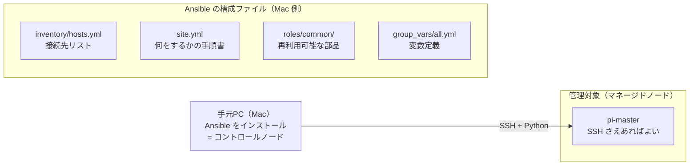
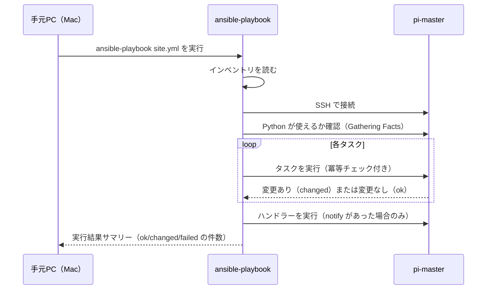

# 06. Ansible による自動化

## このセクションで学ぶこと

- Ansible のアーキテクチャ（インベントリ・Playbook・ロール）を理解する
- ステージ02〜05 で手作業した設定を Ansible Playbook に置き換える
- 冪等性（何度実行しても結果が同じ）の意味と確認方法を身につける

---

## なぜ必要か

ノードが1台のうちは手作業でも何とかなる。ノードが3台・10台と増えたとき、
「全台に同じ設定を正確に入れる」作業が地獄になる。Ansible はこれを解決する：

| 課題 | Ansible なしの場合 | Ansible の場合 |
|------|------------------|---------------|
| 新ノードを追加する | 全手順を最初からやり直す | インベントリに追加して `ansible-playbook site.yml` |
| 設定ミスを修正する | 全ノードに SSH してコマンドを打つ | Playbook を直してもう一度実行 |
| 半年後に「なぜこの設定？」と聞かれる | 作業ログを探す | Playbook のコードが設計書を兼ねる |
| OS 再インストール後の復旧 | 手順書通りに1時間作業 | `ansible-playbook site.yml` で5分 |

---

## 概念の説明

### Ansible のアーキテクチャ

Ansible は**エージェントレス**（ラズパイ側に何もインストール不要）。
手元 Mac から SSH で接続して操作する。



### ディレクトリ構成

```
ansible/
├── ansible.cfg          Ansible の動作設定（インベントリパス、SSH 鍵等）
├── inventory/
│   └── hosts.yml        ノードの一覧と接続情報
├── group_vars/
│   └── all.yml          全ノード共通の変数
├── site.yml             エントリポイント（どのノードにどのロールを適用するか）
└── roles/
    └── common/
        ├── defaults/
        │   └── main.yml     変数のデフォルト値
        ├── tasks/
        │   └── main.yml     タスク（実際の作業手順）
        ├── handlers/
        │   └── main.yml     通知を受けたときだけ動くタスク
        └── templates/
            └── chrony.conf.j2  Jinja2 テンプレート
```

### Playbook の実行フロー



### 冪等性（べきとうせい）とは

**冪等性（idempotency）**：何度実行しても、結果が常に同じになる性質。

```
1回目: changed=5, ok=3  → 設定が5カ所変わった
2回目: changed=0, ok=8  → すでに正しい状態 → 何も変えない
3回目: changed=0, ok=8  → 同じ
```

冪等性がある Playbook は「あるべき状態の定義書」として機能する。
変更したくない場合も、壊れた後の復旧も、同じコマンドで実現できる。

---

## ハンズオン手順

---

### 手順1：Ansible を手元 Mac にインストールする（手元Mac）

**実行マシン：手元PC（Mac）**

```bash
# Homebrew でインストールする
brew install ansible

# バージョンを確認する
ansible --version
# 出力例（最初の行のみ）: ansible [core 2.x.x]

# ansible-lint もインストールする（Playbook の文法チェックツール）
brew install ansible-lint
```

---

### 手順2：リポジトリの ansible/ ディレクトリに移動する（手元Mac）

**実行マシン：手元PC（Mac）**

このリポジトリを手元 Mac にクローンしてから作業する。
Ansible のコマンドは `ansible/` ディレクトリ内から実行する（`ansible.cfg` を参照するため）。

```bash
# リポジトリをクローンする（未実施の場合）
git clone https://github.com/s8s8max/dps-study.git
cd dps-study/ansible

# ディレクトリ構成を確認する
ls -la
```

---

### 手順3：インベントリの IP アドレスを自分の環境に合わせる（手元Mac）

**実行マシン：手元PC（Mac）**

```bash
# inventory/hosts.yml を開いて IP アドレスを修正する
vi inventory/hosts.yml
```

`ansible_host: 192.168.1.100` の部分を `pi-master` の実際の IP アドレスに変更する
（`docs/hardware.md` に記録した値を使う）。

---

### 手順4：疎通確認（ping モジュール）（手元Mac）

**実行マシン：手元PC（Mac）**（`ansible/` ディレクトリ内）

```bash
# すべてのノードに ping モジュールで疎通確認する
ansible all -m ping
```

期待される出力：
```console
pi-master | SUCCESS => {
    "changed": false,
    "ping": "pong"
}
```

`ping` は ICMP ではなく「SSH で接続して Python が動くか」を確認するモジュール。

```bash
# 接続先の情報（Facts）を収集する
ansible all -m gather_facts | head -50
# ← Ansible が収集するシステム情報（OS・IP・CPU 等）の一部を表示
```

---

### 手順5：ロールの中身を理解する

実際のタスク定義を確認する。

**`roles/common/tasks/main.yml` の各タスクの説明：**

```bash
# ファイルの内容を確認する
cat roles/common/tasks/main.yml
```

| タスク名 | 使うモジュール | 説明 |
|---------|------------|------|
| apt キャッシュを更新する | `ansible.builtin.apt` | `apt update` 相当 |
| 共通パッケージをインストールする | `ansible.builtin.apt` | `apt install` 相当 |
| タイムゾーンを設定する | `community.general.timezone` | `timedatectl` 相当 |
| chrony をインストールする | `ansible.builtin.apt` | `apt install chrony` 相当 |
| systemd-timesyncd を無効化する | `ansible.builtin.systemd` | `systemctl disable` 相当 |
| chrony の設定ファイルを配置する | `ansible.builtin.template` | Jinja2 テンプレートから生成 |
| chrony を起動・有効化する | `ansible.builtin.systemd` | `systemctl enable --now` 相当 |
| sshd_config: パスワード認証を無効化 | `ansible.builtin.lineinfile` | 指定行を書き換える |
| sshd_config: root ログイン禁止 | `ansible.builtin.lineinfile` | 指定行を書き換える |

**冪等性のポイント：**
- `apt` モジュールはすでにインストール済みならスキップする
- `template` はファイルの内容が同じならスキップする
- `lineinfile` は regexp に一致する行があれば上書き、なければ追記する

---

### 手順6：community.general コレクションをインストールする（手元Mac）

**実行マシン：手元PC（Mac）**

`timezone` モジュールは `community.general` コレクションに含まれる。

```bash
# コレクションをインストールする
ansible-galaxy collection install community.general

# インストール済みコレクションを確認する
ansible-galaxy collection list | grep community.general
```

---

### 手順7：Playbook を実行する（手元Mac）

**実行マシン：手元PC（Mac）**（`ansible/` ディレクトリ内）

> ⚠️ **事前確認：** SSH 鍵認証で `ssh pi-master` が通ることを確認してから実行する。
> `04-ssh.md` の手順が完了していることが前提。

```bash
# まずドライラン（--check）で変更内容を確認する（実際には変更しない）
ansible-playbook site.yml --check

# 問題なければ本実行する
ansible-playbook site.yml
```

正常終了時の出力例（抜粋）：
```
PLAY RECAP *******************************************************************
pi-master : ok=10  changed=5  unreachable=0  failed=0  skipped=1  rescued=0
```

- `ok`：成功したタスク数（変更なし含む）
- `changed`：実際に変更が発生したタスク数
- `failed`：失敗したタスク数（0 であること）

---

### 手順8：冪等性を確認する（手元Mac）

**実行マシン：手元PC（Mac）**（`ansible/` ディレクトリ内）

```bash
# もう一度実行する
ansible-playbook site.yml
```

期待される出力（抜粋）：
```
PLAY RECAP *******************************************************************
pi-master : ok=10  changed=0  unreachable=0  failed=0  skipped=1  rescued=0
```

**`changed=0` になれば冪等性が確認できた。**
「すでに正しい状態だから何もしなかった」ということを意味する。

---

### 手順9：Playbook に変数を渡す（発展）

```bash
# 特定のタグだけ実行する（タグは tasks/main.yml に付けて使う）
ansible-playbook site.yml --tags chrony

# 特定のホストだけ実行する
ansible-playbook site.yml --limit pi-master

# 詳細ログを表示する（-v: 通常, -vv: 詳細, -vvv: デバッグ）
ansible-playbook site.yml -v
```

---

## 確認方法

**手元Mac のターミナルで実行：**

```bash
# 1. Ansible が pi-master に接続できることを確認する
ansible all -m ping
```

期待される出力：`SUCCESS` と `"ping": "pong"`

```bash
# 2. pi-master のシステム情報を取得できることを確認する
ansible all -m gather_facts -a "filter=ansible_distribution*"
```

期待される出力（抜粋）：
```
"ansible_distribution": "Debian",
"ansible_distribution_release": "bookworm",
```

```bash
# 3. Playbook が正常に終了し、2回目が changed=0 になることを確認する
ansible-playbook site.yml
# 1回目: changed が数件あってもよい

ansible-playbook site.yml
# 2回目: changed=0 であること
```

```bash
# 4. pi-master 上でインストールされたパッケージを確認する
ansible all -m command -a "dpkg -l vim htop chrony"
```

---

## よくあるトラブルと対処

### トラブル1：`ansible all -m ping` で `UNREACHABLE` になる

**原因A：** インベントリの `ansible_host` が間違っている。  
**対処A：**
```bash
# インベントリの内容を確認する
ansible-inventory --list

# 疎通確認（Ansible を使わない方法）
ping 192.168.1.100
ssh pi@192.168.1.100 echo OK
```

**原因B：** `ansible.cfg` が読まれていない（別のディレクトリから実行している）。  
**対処B：**
```bash
# ansible.cfg があるディレクトリに移動してから実行する
cd dps-study/ansible
ansible all -m ping
```

---

### トラブル2：`community.general.timezone` で `ModuleNotFoundError` が出る

**原因：** `community.general` コレクションがインストールされていない。

**対処：**
```bash
ansible-galaxy collection install community.general
# 再実行する
ansible-playbook site.yml
```

---

### トラブル3：`lineinfile` タスクで SSH が再起動されて接続が切れる

**原因：** SSH の設定変更後にハンドラーが SSH を再起動し、接続が切断される。

**対処：** Ansible は再接続を自動的に試みるため、通常は問題なく続行される。
もし Playbook が失敗した場合：
```bash
# 再度実行すれば続きから再開できる（冪等性のおかげ）
ansible-playbook site.yml
```

---

### トラブル4：`gather_facts` で時間がかかる / タイムアウトする

**原因：** SSH 接続が遅い、または Pi が高負荷。

**対処：**
```bash
# ansible.cfg に SSH の接続タイムアウトを追加する
# [defaults] セクションに以下を追記
# timeout = 30

# Facts の収集を省略して高速化する（デバッグ用）
ansible-playbook site.yml --skip-tags gather_facts
# または site.yml に gather_facts: false を追加する
```

---

## 演習課題

### 課題1

`group_vars/all.yml` の `common_packages` リストに `tree` パッケージを追加して、
Ansible Playbook で pi-master にインストールしなさい。
インストール後、`tree /etc/chrony` コマンドで確認する。

<details>
<summary>解答例</summary>

```bash
# group_vars/all.yml を編集する
vi ansible/group_vars/all.yml
# common_packages に "- tree" を追加する

# Playbook を実行する
cd ansible
ansible-playbook site.yml

# 確認する
ansible all -m command -a "tree /etc/chrony"
# または
ssh pi-master tree /etc/chrony
```

2回目の実行では `changed=0` になることを確認する（`tree` はすでにインストール済みなのでスキップ）。

</details>

---

### 課題2

`ansible/` ディレクトリで次のコマンドを実行し、インベントリに登録されたすべての変数を確認しなさい。
また、`ansible_host` と `timezone` がどこで定義されているかを説明しなさい。

```bash
ansible-inventory --host pi-master
```

<details>
<summary>解答例</summary>

```bash
cd ansible
ansible-inventory --host pi-master
```

出力例（抜粋）：
```json
{
    "ansible_host": "192.168.1.100",
    "ansible_user": "pi",
    "chrony_ntp_servers": ["2.debian.pool.ntp.org"],
    "sshd_password_authentication": "no",
    "sshd_permit_root_login": "no",
    "timezone": "Asia/Tokyo",
    ...
}
```

変数の定義元：
- `ansible_host`：`inventory/hosts.yml` で定義
- `timezone`：`group_vars/all.yml` で定義（全ノード共通）

変数の優先順位（低 → 高）：
`roles/defaults` → `group_vars` → `host_vars` → Playbook の `vars:` → コマンドライン `-e`

</details>

---

### 課題3

`roles/common/tasks/main.yml` に新しいタスクを追加して、
`/etc/motd`（ログイン時のメッセージ）を「`Managed by Ansible`」という内容に設定しなさい。
**`command` や `shell` モジュールは使わず、冪等性を持たせること。**

<details>
<summary>解答例</summary>

```yaml
# roles/common/tasks/main.yml の末尾に追加する
- name: ログイン時のメッセージ（MOTD）を設定する
  ansible.builtin.copy:
    content: "Managed by Ansible\n"
    dest: /etc/motd
    owner: root
    group: root
    mode: "0644"
```

`copy` モジュールは `content` と現在のファイル内容を比較し、
同じであれば `ok`（変更なし）を返す → 冪等性あり。

確認：
```bash
ssh pi-master cat /etc/motd
# 出力: Managed by Ansible
```

</details>

---

## 参考資料

- [Ansible 公式ドキュメント（Getting Started）](https://docs.ansible.com/ansible/latest/getting_started/index.html)
- [Ansible モジュールインデックス](https://docs.ansible.com/ansible/latest/collections/index_module.html)
- [community.general.timezone モジュール](https://docs.ansible.com/ansible/latest/collections/community/general/timezone_module.html)
- [Ansible のベストプラクティス](https://docs.ansible.com/ansible/latest/tips_tricks/ansible_tips_tricks.html)
