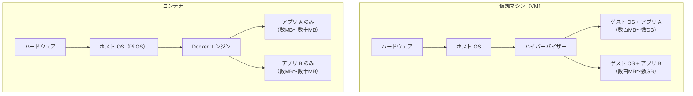

# 07. Docker のセットアップと基本操作

## このセクションで学ぶこと

- コンテナの概念と VM との違いを理解する
- Raspberry Pi 3B（arm64）に Docker CE をインストールする
- `docker` コマンドと Docker Compose の基本操作を習得する

---

## なぜ必要か

分散処理の各コンポーネント（ワーカープロセス・メッセージキュー・監視ツール）を
ラズパイ1台で動かすとき、コンテナは必須の道具になる：

| 課題 | コンテナなしの場合 | コンテナの場合 |
|------|-----------------|--------------|
| 複数のワーカープロセスを分離して動かしたい | 手動でポート管理・プロセス管理 | 各コンテナが独立した名前空間を持つ |
| Python バージョンが違うアプリを同居させたい | 仮想環境が複雑に絡み合う | コンテナごとに依存関係が完全に分離 |
| 全部まとめて起動・停止したい | systemd ユニットを手作りで管理 | `docker compose up / down` の1コマンド |
| 「この環境を再現して」と言われたとき | 手順書を渡す | `compose.yml` を渡す |

---

## 概念の説明

### コンテナと仮想マシン（VM）の違い



コンテナは OS カーネルをホストと共有するため、VM より圧倒的に軽量。
Pi 3B の 1GB RAM でも複数コンテナを動かせる理由がここにある。

### arm64 とコンテナイメージ

コンテナイメージはアーキテクチャごとに異なるバイナリを持つ。
Pi 3B は arm64（aarch64）なので、**arm64 対応のイメージを使う必要がある**。

```bash
# イメージが arm64 対応かどうかを確認する方法
docker buildx imagetools inspect nginx:1.27-alpine | grep -A3 "Platform"
# linux/arm64 の行があれば使える
```

> ⚠️ Docker Hub でイメージを検索するとき、`Supported architectures` に `arm64` が含まれるか必ず確認する。
> x86 専用のイメージを pull しようとすると `exec format error` が出る。

### Docker のアーキテクチャ

```
[手元Mac]                  [pi-master]
docker コマンド  ──SSH──>  Docker デーモン（dockerd）
                            └── コンテナ A（プロセス）
                            └── コンテナ B（プロセス）
                            └── イメージのキャッシュ
                            └── ボリューム（永続データ）
```

---

## ハンズオン手順

---

### 手順1：Docker を手動でインストールする（pi-master）

**実行マシン：pi-master（SSH 接続後）**

まず手作業でインストールし、仕組みを理解する。その後 Ansible で自動化する。

```bash
# /etc/apt/keyrings ディレクトリを作成する（なければ）
sudo install -m 0755 -d /etc/apt/keyrings

# Docker の公式 GPG キーをダウンロードする
sudo curl -fsSL https://download.docker.com/linux/debian/gpg \
  -o /etc/apt/keyrings/docker.asc
sudo chmod a+r /etc/apt/keyrings/docker.asc

# Docker の apt リポジトリを追加する（arm64 を明示）
echo \
  "deb [arch=arm64 signed-by=/etc/apt/keyrings/docker.asc] \
  https://download.docker.com/linux/debian \
  $(. /etc/os-release && echo "$VERSION_CODENAME") stable" | \
  sudo tee /etc/apt/sources.list.d/docker.list > /dev/null

# パッケージリストを更新してインストールする
sudo apt update
sudo apt install -y \
  docker-ce \
  docker-ce-cli \
  containerd.io \
  docker-buildx-plugin \
  docker-compose-plugin

# Docker の起動・自動起動を有効にする
sudo systemctl enable --now docker

# インストール確認
docker --version
docker compose version
```

期待される出力例：
```
Docker version 27.x.x, build xxxxxxx
Docker Compose version v2.x.x
```

---

### 手順2：pi ユーザーを docker グループに追加する（pi-master）

**実行マシン：pi-master**

デフォルトでは `docker` コマンドに `sudo` が必要。グループ追加で不要にする。

```bash
# pi ユーザーを docker グループに追加する
sudo usermod -aG docker pi

# 反映のためいったん SSH セッションを切って再接続する
exit
```

```bash
# 手元Mac から再接続する
ssh pi-master

# sudo なしで docker コマンドが使えることを確認する
docker ps
# 出力例: CONTAINER ID   IMAGE   COMMAND   CREATED   STATUS   PORTS   NAMES（空行）
```

---

### 手順3：Docker の基本コマンドを試す（pi-master）

**実行マシン：pi-master**

```bash
# テスト用コンテナを実行する（arm64 対応の hello-world）
docker run hello-world

# 出力例（抜粋）:
# Hello from Docker!
# This message shows that your installation appears to be working correctly.

# 実行中のコンテナを一覧表示する（-a で停止中も含む）
docker ps -a
# 出力例:
# CONTAINER ID   IMAGE         COMMAND    CREATED        STATUS                    ...
# xxxxxxxxxxxx   hello-world   "/hello"   1 second ago   Exited (0) 1 second ago   ...

# ローカルに保存されているイメージ一覧
docker images
# 出力例:
# REPOSITORY    TAG       IMAGE ID       CREATED        SIZE
# hello-world   latest    xxxxxxxxxx     2 weeks ago    29.1kB

# 停止したコンテナを削除する
docker rm $(docker ps -aq -f status=exited)

# イメージを削除する
docker rmi hello-world
```

---

### 手順4：nginx コンテナを起動して動作を確認する（pi-master）

**実行マシン：pi-master**

```bash
# nginx の arm64 対応イメージを起動する（バージョンを固定）
# -d: バックグラウンド実行、-p: ポートマッピング（ホスト:コンテナ）
docker run -d --name test-nginx -p 8080:80 nginx:1.27-alpine

# 起動しているか確認する
docker ps
# 出力例:
# CONTAINER ID   IMAGE              COMMAND                  CREATED        STATUS        PORTS                  NAMES
# xxxxxxxxxxxx   nginx:1.27-alpine  "/docker-entrypoint.…"   5 seconds ago  Up 4 seconds  0.0.0.0:8080->80/tcp   test-nginx

# ラズパイ内からアクセスして動作確認する
curl http://localhost:8080
# 出力: <html>... nginx のデフォルトページが返ってくる

# コンテナのログを確認する
docker logs test-nginx

# コンテナを停止・削除する
docker stop test-nginx
docker rm test-nginx
```

手元 Mac のブラウザからも確認できる（SSH ポートフォワーディングを使う場合）：

```bash
# 手元Mac のターミナルで実行
ssh -L 8080:localhost:8080 pi-master
# ブラウザで http://localhost:8080 を開く
```

---

### 手順5：Docker Compose で複数コンテナを管理する（pi-master）

**実行マシン：pi-master**

Docker Compose はYAML ファイルで複数のコンテナをまとめて管理するツール。

```bash
# テスト用のディレクトリを作成する
mkdir ~/docker-test && cd ~/docker-test

# compose.yml を作成する
cat > compose.yml << 'EOF'
services:
  web:
    image: nginx:1.27-alpine
    ports:
      - "8080:80"
    restart: unless-stopped
EOF

# コンテナをバックグラウンドで起動する
docker compose up -d

# 起動確認
docker compose ps

# ログを確認する
docker compose logs

# 停止・削除する
docker compose down

# テスト用ディレクトリを片付ける
cd ~ && rm -r docker-test
```

---

### 手順6：Ansible で Docker インストールを自動化する（手元Mac）

**実行マシン：手元PC（Mac）**（`ansible/` ディレクトリ内）

手順1〜2 で手作業したことを `roles/docker` ロールが自動化する。

```bash
# ロールの中身を確認する
cat roles/docker/tasks/main.yml
```

タスクの確認ポイント：
- GPG キーのダウンロードは `force: false` で冪等性を確保
- `apt_repository` モジュールがリポジトリの重複追加を防ぐ
- `user` モジュールの `append: true` でグループを追記（既存グループを消さない）
- `meta: reset_connection` でグループ変更をその場で反映

```bash
# ドライランで変更内容を確認する
ansible-playbook site.yml --check

# 本実行する（Docker インストールは時間がかかる）
ansible-playbook site.yml
```

**2回目の実行で冪等性を確認する：**

```bash
ansible-playbook site.yml
# → changed=0 になること
```

---

### 手順7：Docker の動作確認を Ansible で実施する（手元Mac）

**実行マシン：手元PC（Mac）**

```bash
# pi-master で Docker が動いているか Ansible で確認する
ansible all -m command -a "docker ps" --become-user pi
# または
ansible all -m shell -a "docker version --format '{{.Server.Version}}'"
```

---

## 確認方法

**pi-master 上で実行：**

```bash
# 1. Docker サービスが起動していることを確認する
systemctl is-active docker
```

期待される出力：`active`

```bash
# 2. Docker のバージョンを確認する
docker version --format '{{.Server.Version}}'
```

期待される出力例：`27.x.x`（27 以降であれば問題なし）

```bash
# 3. arm64 環境で hello-world が動くことを確認する
docker run --rm hello-world 2>&1 | grep "Hello from Docker"
```

期待される出力：`Hello from Docker!`

```bash
# 4. Docker Compose プラグインが使えることを確認する
docker compose version
```

期待される出力例：`Docker Compose version v2.x.x`

```bash
# 5. pi ユーザーが docker グループに属していることを確認する
groups
```

期待される出力（docker を含むこと）：`pi adm dialout cdrom sudo audio ... docker`

---

## よくあるトラブルと対処

### トラブル1：`docker run hello-world` で `exec format error` が出る

**原因：** pull されたイメージが x86_64 用で、arm64 で動かない。

**対処：**
```bash
# --platform を明示して arm64 イメージを指定する
docker run --rm --platform linux/arm64 hello-world

# イメージのアーキテクチャを確認する
docker inspect hello-world | grep Architecture
```

Docker Hub でイメージを選ぶときは `Supported architectures` に `arm64` があるものを使う。

---

### トラブル2：`docker` コマンドで `permission denied` が出る

**原因：** ユーザーが `docker` グループに追加されているが、SSH セッションが更新されていない。

**対処：**
```bash
# グループへの所属を確認する
groups
# docker が含まれていない場合は再ログインが必要

# いったん SSH を切って再接続する
exit
# → ssh pi-master で再接続
```

---

### トラブル3：`docker pull` が遅い / タイムアウトする

**原因：** Pi 3B の 100Mbps 有線 LAN または Wi-Fi の帯域制限。大きなイメージは時間がかかる。

**対処：**
```bash
# ダウンロードの進捗をリアルタイムで確認する
docker pull nginx:1.27-alpine
# ← レイヤーごとに進捗バーが表示される

# イメージサイズを最小にするため alpine ベースのイメージを優先的に使う
# nginx:1.27-alpine は nginx:1.27 より大幅に小さい
docker images nginx
```

---

### トラブル4：コンテナ起動後にメモリが圧迫される（Pi 3B の制約）

**原因：** Pi 3B の RAM は 1GB のため、複数コンテナを起動するとメモリが逼迫する。

**対処：**
```bash
# 全コンテナのメモリ使用量をリアルタイムで確認する
docker stats

# コンテナにメモリ制限を設ける（compose.yml の場合）
# services:
#   app:
#     image: ...
#     mem_limit: 128m    ← 128MB に制限
```

`docker stats` の確認習慣を今から身につけておくと、ステージ8の監視スタック構築で役立つ。

---

## 演習課題

### 課題1

arm64 対応の Alpine Linux コンテナを起動して、その中で `uname -m` を実行しなさい（コンテナの中が arm64 であることを確認する）。

<details>
<summary>解答例</summary>

```bash
# pi-master 上で実行

# Alpine Linux コンテナをインタラクティブモードで起動する
# --rm: 終了時に自動削除
# -it: 端末を割り当て（インタラクティブ）
docker run --rm -it alpine:3.21 sh

# コンテナの中で実行する
uname -m
# 出力: aarch64  ← arm64 であることが確認できる

exit  # コンテナから抜ける
```

または1コマンドで：
```bash
docker run --rm alpine:3.21 uname -m
# 出力: aarch64
```

</details>

---

### 課題2

`docker compose` を使って nginx を起動し、コンテナを**停止せずに**設定ファイルを確認しなさい（`docker exec` を使う）。

<details>
<summary>解答例</summary>

```bash
# pi-master 上で実行

# compose.yml で nginx を起動する
mkdir ~/test-exec && cd ~/test-exec
cat > compose.yml << 'EOF'
services:
  web:
    image: nginx:1.27-alpine
    ports:
      - "8080:80"
EOF

docker compose up -d

# docker exec で実行中のコンテナ内でコマンドを実行する
docker exec test-exec-web-1 cat /etc/nginx/nginx.conf

# または sh でシェルを起動する
docker exec -it test-exec-web-1 sh
# → コンテナ内のシェルに入る
# exit で抜ける

# 後片付け
docker compose down
cd ~ && rm -r test-exec
```

`docker exec` は稼働中のコンテナを調査・デバッグするときに頻繁に使うコマンド。

</details>

---

### 課題3

現在 pi-master で使用中の Docker イメージの一覧と、合計ディスク使用量を確認しなさい。

<details>
<summary>解答例</summary>

```bash
# pi-master 上で実行

# イメージ一覧とサイズを確認する
docker images

# Docker 全体のディスク使用量を確認する（イメージ・コンテナ・ボリュームの内訳）
docker system df

# 出力例:
# TYPE            TOTAL     ACTIVE    SIZE      RECLAIMABLE
# Images          2         0         29.1MB    29.1MB (100%)
# Containers      0         0         0B        0B
# Local Volumes   0         0         0B        0B
# Build Cache     0         0         0B        0B

# 未使用のイメージ・コンテナ・ボリュームを一括削除する（容量節約）
# docker system prune
# ← 実行するとダンロード済みイメージも消える。必要なときだけ実行する
```

Pi 3B はストレージも限られるため（microSD）、`docker system df` の確認習慣をつけておく。

</details>

---

## 参考資料

- [Docker 公式ドキュメント：Debian へのインストール](https://docs.docker.com/engine/install/debian/)
- [Docker Hub：arm64 対応イメージの検索](https://hub.docker.com/)（Architectures フィルターで `ARM 64` を選ぶ）
- [Docker Compose ファイルリファレンス](https://docs.docker.com/compose/compose-file/)
- [docker コマンドリファレンス](https://docs.docker.com/engine/reference/commandline/cli/)
