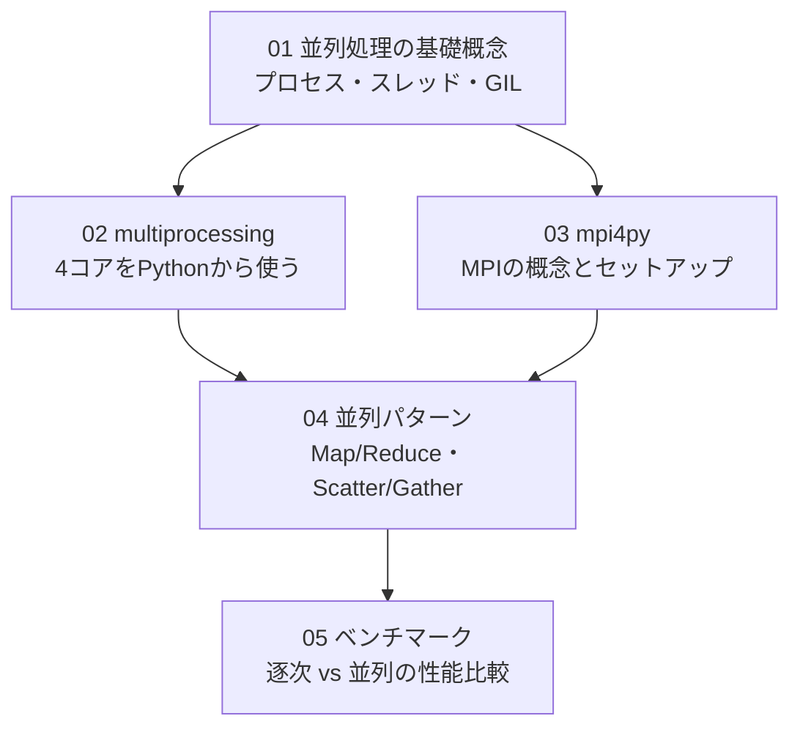

# Stage 1 設計ドキュメント：並列計算の基本

## 学習目標

- CPU の複数コアを Python から活用する方法を習得する
- プロセスとスレッドの違いを理解し、GIL を回避する設計を学ぶ
- MPI（Message Passing Interface）の概念と mpi4py の基本操作を習得する
- 逐次処理と並列処理の性能を計測・比較できるようになる

## 前提

| 項目 | 内容 |
|---|---|
| ハードウェア | Raspberry Pi 3 Model B（4 コア、1GB RAM）|
| OS | Raspberry Pi OS Lite 64-bit（Bookworm）|
| Stage 0 完了 | SSH・Docker・Ansible・モニタリングが動いていること |

---

## 学習ステップの依存関係



---

## 各ステップの概要

### 01 並列処理の基礎概念（所要時間：約 1 時間）

**学ぶこと**
- 並行性（Concurrency）vs 並列性（Parallelism）の違い
- プロセスとスレッドの違い（メモリ空間、オーバーヘッド）
- Python の GIL（Global Interpreter Lock）とその影響
- CPU バウンド vs I/O バウンドの判断基準

**主なツール・コマンド**
```bash
python3 -c "import os; print(os.cpu_count())"   # コア数確認
htop                                              # CPU 使用率をリアルタイム確認
```

---

### 02 Python multiprocessing（所要時間：約 2 時間）

**学ぶこと**
- `multiprocessing.Pool` で並列 Map を実行する
- `Process` クラスで明示的にプロセスを起動する
- プロセス間通信（`Queue`、`Pipe`）
- Pi 3B の 4 コアを使った実測（モンテカルロ法・素数探索）

**主なツール・コマンド**
```python
from multiprocessing import Pool, cpu_count
with Pool(cpu_count()) as p:
    results = p.map(func, data)
```

---

### 03 mpi4py（所要時間：約 2 時間）

**学ぶこと**
- MPI の基本概念（rank、size、communicator）
- `Send` / `Recv`：点対点通信
- `Bcast`：ブロードキャスト
- `Scatter` / `Gather`：データ分散・収集
- シングルノードでの MPI 実行（ランク = プロセス）

**主なツール・コマンド**
```bash
pip install mpi4py
mpirun -np 4 python3 hello_mpi.py
```

---

### 04 並列パターン（所要時間：約 2 時間）

**学ぶこと**
- Map/Reduce パターン：データを分割して並列処理し結果を集約
- Scatter/Gather パターン：MPI で大きな配列を各プロセスに分配
- Producer/Consumer パターン：`Queue` を使ったパイプライン処理
- 実践例：行列乗算の並列化

---

### 05 ベンチマーク（所要時間：約 1.5 時間）

**学ぶこと**
- `time.perf_counter()` と `timeit` による計測方法
- プロセス数と実行時間の関係（アムダールの法則）
- Pi 3B での実測値（逐次 vs 2 並列 vs 4 並列）
- ボトルネックの特定方法

---

## サンプルコード一覧

`python/stage1/` に以下のコードを配置します：

| ファイル | 内容 |
|---|---|
| `01_gil_demo.py` | GIL の影響を確認するデモ |
| `02_pool_map.py` | `Pool.map` で並列素数探索 |
| `03_queue_pipeline.py` | `Queue` を使ったプロデューサー・コンシューマー |
| `04_mpi_hello.py` | MPI Hello World（rank 表示）|
| `04_mpi_scatter_gather.py` | Scatter/Gather で配列処理 |
| `05_benchmark.py` | 逐次 vs 並列のベンチマーク比較 |
| `05_monte_carlo.py` | モンテカルロ法による円周率推定（逐次・並列） |

---

## Stage 1 完了チェックリスト

- [ ] `os.cpu_count()` が `4` を返すことを確認した
- [ ] `multiprocessing.Pool` で逐次より速い実行を確認した
- [ ] `mpirun -np 4` で 4 プロセスが起動することを確認した
- [ ] Scatter/Gather で配列を分割・収集できた
- [ ] ベンチマークで並列化による速度向上を数値で確認した

---

## 次のステージ

Stage 1 が完了したら Stage 2（メッセージングとパイプライン：ZeroMQ、MQTT/NATS）に進みます。
Stage 1 で学ぶ「プロセス間通信」の概念が Stage 2 の基盤になります。
