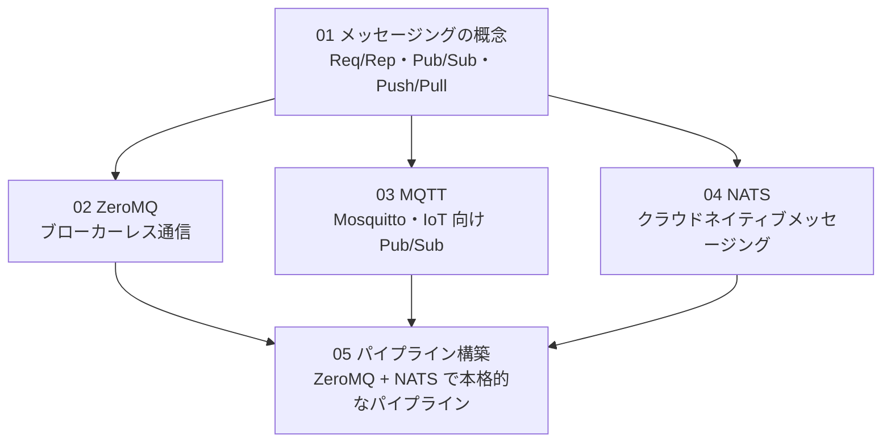

# Stage 2 設計ドキュメント：メッセージングとパイプライン

## 学習目標

- メッセージングの 3 大パターン（Req/Rep、Pub/Sub、Push/Pull）を理解する
- ZeroMQ でブローカーレスのプロセス間通信を実装できる
- Mosquitto（MQTT）で IoT 向けの Pub/Sub を体験する
- NATS でクラウドネイティブなメッセージングを体験する
- これらを組み合わせたデータパイプラインを構築できる

## 前提

| 項目 | 内容 |
|---|---|
| ハードウェア | Raspberry Pi 3B（4 コア、1GB RAM）|
| Stage 1 完了 | multiprocessing、mpi4py の基礎が身についていること |
| Docker | Stage 0 で構築した Docker 環境（ブローカーをコンテナで動かす）|

---

## Stage 1 との違い

```
Stage 1: 同一ノード内のプロセス間通信
  Queue / MPI Send-Recv → 同じ Pi 上のプロセス同士

Stage 2: ネットワーク越しの通信（将来のマルチノードへの橋渡し）
  ZeroMQ / MQTT / NATS → TCP ソケット経由で通信
  → ノードを増やしてもコードをほぼ変えずにスケールできる
```

---

## 学習ステップの依存関係



---

## 各ステップの概要

### 01 メッセージングの概念（約 1 時間）

**学ぶこと**
- なぜメッセージングが必要か（疎結合・非同期・バッファリング）
- Req/Rep（リクエスト・応答）パターン
- Pub/Sub（発行・購読）パターン
- Push/Pull（分散キュー）パターン
- ブローカーありとブローカーなしの違い

---

### 02 ZeroMQ（約 2 時間）

**学ぶこと**
- ZeroMQ のソケット型（REQ/REP、PUB/SUB、PUSH/PULL）
- ブローカーレスで直接接続する設計
- `pyzmq` のインストールと基本操作
- 実践：センサーデータのストリーミング

---

### 03 MQTT（約 2 時間）

**学ぶこと**
- MQTT のブローカーモデル（Mosquitto を Docker で起動）
- トピック階層（`sensor/pi-master/cpu` など）
- QoS レベル（0/1/2）の違い
- `paho-mqtt` での Publish / Subscribe
- 実践：Pi の CPU 温度を定期送信

---

### 04 NATS（約 2 時間）

**学ぶこと**
- NATS の特徴（軽量・高スループット・クラウドネイティブ）
- Pub/Sub、Request/Reply、Queue Subscribe の使い分け
- `nats-py` での基本操作
- JetStream によるメッセージ永続化の概要

---

### 05 パイプライン構築（約 2 時間）

**学ぶこと**
- ZeroMQ Push/Pull でワーカープールを作る
- NATS で結果を集約・通知する
- Docker Compose で全コンポーネントを管理する
- Grafana でパイプラインのスループットを可視化する

---

## サンプルコード一覧

`python/stage2/` に以下のコードを配置します：

| ファイル | 内容 |
|---|---|
| `01_zmq_reqrep.py` | ZeroMQ Req/Rep（エコーサーバー）|
| `02_zmq_pubsub.py` | ZeroMQ Pub/Sub（センサー模擬）|
| `03_zmq_pushpull.py` | ZeroMQ Push/Pull（ワーカープール）|
| `04_mqtt_pub.py` | MQTT Publish（CPU 温度送信）|
| `04_mqtt_sub.py` | MQTT Subscribe（データ受信・表示）|
| `05_nats_pubsub.py` | NATS Pub/Sub の基本 |
| `05_nats_reqrep.py` | NATS Request/Reply |
| `06_pipeline_producer.py` | パイプライン：データ生成側 |
| `06_pipeline_worker.py` | パイプライン：ワーカー |
| `06_pipeline_collector.py` | パイプライン：集約側 |

## Docker Compose

`docker/messaging/compose.yml` で Mosquitto と NATS を起動します：

```bash
cd docker/messaging
docker compose up -d
```

---

## Stage 2 完了チェックリスト

- [ ] ZeroMQ の Req/Rep、Pub/Sub、Push/Pull が動いた
- [ ] Mosquitto ブローカーに MQTT で Pub/Sub できた
- [ ] NATS に接続して Pub/Sub できた
- [ ] ZeroMQ Push/Pull でワーカープールを作れた
- [ ] パイプラインで生成→処理→集約の流れを確認した

---

## 次のステージ

Stage 2 が完了したら Stage 3（状態を持つストリーム処理：パーティショニング・時間窓・Redpanda）に進みます。
