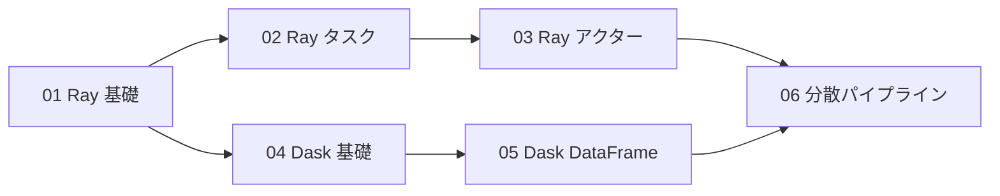

# Stage 4 学習ガイド：分散フレームワーク（Ray・Dask）

## 目標

Stage 1–3 で「自前実装」した並列・分散処理を **フレームワーク** に任せる。
Ray は汎用分散実行エンジン、Dask は NumPy/pandas を分散スケールへ拡張する。

## 依存グラフ



## ステップ一覧

| ステップ | テーマ | ドキュメント | コード |
|---------|--------|--------------|--------|
| 01 | Ray 基礎 | `docs/stage4/01-ray-basics.md` | `python/stage4/01_ray_hello.py` |
| 02 | Ray タスク | `docs/stage4/02-ray-tasks.md` | `python/stage4/02_ray_tasks.py` |
| 03 | Ray アクター | `docs/stage4/03-ray-actors.md` | `python/stage4/03_ray_actors.py` |
| 04 | Dask 基礎 | `docs/stage4/04-dask.md` | `python/stage4/04_dask_delayed.py` |
| 05 | Dask DataFrame | `docs/stage4/04-dask.md` | `python/stage4/05_dask_dataframe.py` |
| 06 | 分散パイプライン | `docs/stage4/05-distributed-pipeline.md` | `python/stage4/06_pipeline.py` |

## Stage 1–3 との対応

| 自前実装（Stage 1–3） | フレームワーク（Stage 4） |
|----------------------|--------------------------|
| `multiprocessing.Pool.map` | `ray.remote` + `ray.get` |
| `multiprocessing.Queue` パイプライン | Ray Actor + `ray.put` |
| キー付き状態管理（dict） | Ray Actor（分散ステート） |
| 時間窓集計（asyncio） | Dask delayed + reduce |
| pandas for ループ | Dask DataFrame（パーティション自動分割） |

## インストール

```bash
pip install ray[default] dask[complete] pyarrow
```

Pi 3B 向け最小インストール（容量節約）：

```bash
pip install ray dask pyarrow
```

## ハードウェア注意

| フレームワーク | Pi 3B（1GB） | Pi 4（2GB+） |
|--------------|-------------|-------------|
| Ray（シングルノード） | 動作可（制約あり） | 快適 |
| Ray（クラスター） | head + 1 worker が限界 | 3–4 ノードで快適 |
| Dask（single-machine） | 動作可 | 快適 |
| Dask（distributed） | 2 worker まで | 4 worker 推奨 |

Ray は起動時にオブジェクトストア（共有メモリ）を確保する。
Pi 3B では `object_store_memory=128*1024*1024`（128MB）を明示する。

## Stage 4 完了チェックリスト

- [ ] `ray.init()` が Pi 上で起動した（`object_store_memory` を指定）
- [ ] `@ray.remote` タスクを並列実行し、`ray.get` で結果を回収できた
- [ ] `ray.wait` でバックプレッシャーをかけられた
- [ ] Ray Actor で状態を保持し、複数タスクから更新できた
- [ ] Actor をシャーディングして負荷を分散できた
- [ ] `dask.delayed` で DAG を構築し `compute()` で実行できた
- [ ] Dask のスケジューラ（synchronous / threads / processes）を切り替えて違いを確認した
- [ ] Dask DataFrame で pandas より大きいデータを分割処理できた
- [ ] `06_pipeline.py` でリアルタイム集計とバッチ集計を両立できた

## 次のステージ

Stage 4 が完了したら Stage 5（オーケストレーションと耐障害性：k3s）に進みます。
ここまではプロセスを手動で起動していましたが、Stage 5 ではコンテナを自動で配置・再起動させます。
