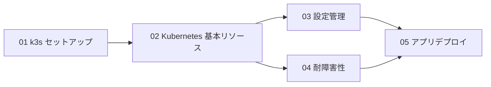

# Stage 5 学習ガイド：オーケストレーションと耐障害性（k3s）

## 目標

Stage 2–4 で作ったアプリを **k3s**（軽量 Kubernetes）でコンテナオーケストレーションする。
自動再起動・ローリングアップデート・ヘルスチェックで「落ちにくい」システムを構築する。

## 依存グラフ



## ステップ一覧

| ステップ | テーマ | ドキュメント | マニフェスト |
|---------|--------|--------------|--------|
| 01 | k3s セットアップ | `docs/stage5/01-k3s-setup.md` | クラスター構築 |
| 02 | Kubernetes 基本リソース | `docs/stage5/02-k8s-basics.md` | `k8s/stage5/` の 01〜04 |
| 03 | 設定管理 | `docs/stage5/03-config-management.md` | `k8s/stage5/` の 05 |
| 04 | 耐障害性 | `docs/stage5/04-fault-tolerance.md` | `k8s/stage5/` の 06 |
| 05 | アプリデプロイ | `docs/stage5/05-app-deployment.md` | `k8s/stage5/` の 07〜08 |

## マニフェスト一覧（`k8s/stage5/`）

| ファイル | 内容 |
|---------|------|
| `01-namespace.yaml` | `dps-study` Namespace |
| `02-pod.yaml` | 学習用の単体 Pod（busybox） |
| `03-deployment.yaml` | hello-deploy（replicas=2、RollingUpdate） |
| `04-service.yaml` | ClusterIP + NodePort:30080 |
| `05-configmap-secret.yaml` | ConfigMap と Secret のサンプル（**`.gitignore` 推奨**） |
| `06-probes-deployment.yaml` | liveness / readiness probe 付き health-server |
| `07-nats.yaml` | NATS Deployment + ClusterIP + NodePort:30222 |
| `08-pipeline.yaml` | pipeline-worker（replicas=3、リソース上限つき） |

## サンプルコード一覧（`python/stage5/`）

| ファイル | 内容 | 実行方法 |
|---------|------|---------|
| `01_health_server.py` | probe 用ヘルスサーバー（`/health`・`/ready`・`/fail`・`/toggle`） | `python3 01_health_server.py` |
| `02_k8s_watch.py` | kubectl 経由で Pod 状態・再起動を監視 | `python3 02_k8s_watch.py -n dps-study` |
| `03_rolling_update.py` | デプロイ→スケール→更新→ロールバックの対話デモ | `python3 03_rolling_update.py` |

## コンテナイメージ

`docker/stage5/Dockerfile` は `01_health_server.py` を arm64 イメージにします。

```bash
docker build -t health-server:latest -f docker/stage5/Dockerfile .

# k3s は containerd を使うため、ローカルイメージは import が必要
docker save health-server:latest | sudo k3s ctr images import -
```

## Docker Compose vs k3s

| 項目 | Docker Compose | k3s（Kubernetes） |
|------|---------------|-------------------|
| 管理単位 | コンテナ | Pod（1〜複数コンテナ） |
| スケーリング | `docker compose scale` | `kubectl scale` / HPA |
| 自動再起動 | `restart: always` | Deployment + liveness probe |
| ローリングアップデート | 手動 | `kubectl rollout` |
| 複数ノード | 不可 | 標準機能（ノード追加だけ） |
| ヘルスチェック | healthcheck: | liveness / readiness probe |
| 設定・秘密情報 | `.env` / secrets | ConfigMap / Secret |

## ハードウェア注意

| 役割 | 推奨 | Pi 3B での注意 |
|------|------|---------------|
| k3s master | Pi 3B〜 | k3s 本体 ~400MB。残り ~600MB で Pod |
| k3s worker | Pi 3B〜 | 軽量 Pod 2〜3 個まで |
| Redpanda Pod | Pi 4（2GB+） | Pi 3B では OOM になる可能性あり |

## インストール

```bash
# Pi 3B/4 上で
curl -sfL https://get.k3s.io | sh -

# 動作確認
kubectl get nodes
kubectl get pods -A
```

## Stage 5 完了チェックリスト

- [ ] k3s をインストールし `kubectl get nodes` が Ready を返した
- [ ] 手元の Mac から kubeconfig 経由で kubectl を使えた
- [ ] Pod・Deployment・Service の役割の違いを説明できる
- [ ] `kubectl scale` でレプリカ数を増減できた
- [ ] Pod を削除しても Deployment が自動で作り直すことを確認した
- [ ] NodePort 経由で Pi の外からアクセスできた
- [ ] ConfigMap の値を環境変数として Pod に渡せた
- [ ] Secret を作成し、リポジトリに平文で置かない運用を理解した
- [ ] liveness probe を失敗させて Pod が再起動するのを確認した
- [ ] readiness probe を落として Service から除外されるのを確認した
- [ ] ローリングアップデートを実行し、無停止で更新できた
- [ ] `kubectl rollout undo` で前のバージョンに戻せた

## 次のステージ

Stage 5 が完了したら Stage 6（分散システムの理論：Raft・CAP・論理時計）に進みます。
Stage 5 で使った etcd は内部で Raft を動かしています。Stage 6 でその仕組みを解き明かします。
