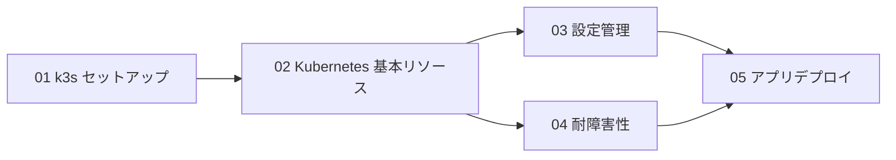

# Stage 5 学習ガイド：オーケストレーションと耐障害性（k3s）

## 目標

Stage 2–4 で作ったアプリを **k3s**（軽量 Kubernetes）でコンテナオーケストレーションする。
自動再起動・ローリングアップデート・ヘルスチェックで「落ちにくい」システムを構築する。

## 依存グラフ



## ステップ一覧

| ステップ | テーマ | ドキュメント | 成果物 |
|---------|--------|--------------|--------|
| 01 | k3s セットアップ | `docs/stage5/01-k3s-setup.md` | クラスター構築 |
| 02 | Kubernetes 基本リソース | `docs/stage5/02-k8s-basics.md` | `k8s/stage5/01〜04` |
| 03 | 設定管理 | `docs/stage5/03-config-management.md` | `k8s/stage5/05` |
| 04 | 耐障害性 | `docs/stage5/04-fault-tolerance.md` | `k8s/stage5/06` |
| 05 | アプリデプロイ | `docs/stage5/05-app-deployment.md` | `k8s/stage5/07〜08` |

## Docker Compose vs k3s

| 項目 | Docker Compose | k3s（Kubernetes） |
|------|---------------|-------------------|
| 管理単位 | コンテナ | Pod（1〜複数コンテナ） |
| スケーリング | `docker compose scale` | `kubectl scale` / HPA |
| 自動再起動 | `restart: always` | Deployment + liveness probe |
| ローリングアップデート | 手動 | `kubectl rollout` |
| 複数ノード | 不可 | 標準機能（ノード追加だけ） |
| ヘルスチェック | healthcheck: | liveness / readiness probe |
| 設定・秘密情報 | `.env` / secrets | ConfigMap / Secret |

## ハードウェア注意

| 役割 | 推奨 | Pi 3B での注意 |
|------|------|---------------|
| k3s master | Pi 3B〜 | k3s 本体 ~400MB。残り ~600MB で Pod |
| k3s worker | Pi 3B〜 | 軽量 Pod 2〜3 個まで |
| Redpanda Pod | Pi 4（2GB+） | Pi 3B では OOM になる可能性あり |

## インストール

```bash
# Pi 3B/4 上で
curl -sfL https://get.k3s.io | sh -

# 動作確認
kubectl get nodes
kubectl get pods -A
```
