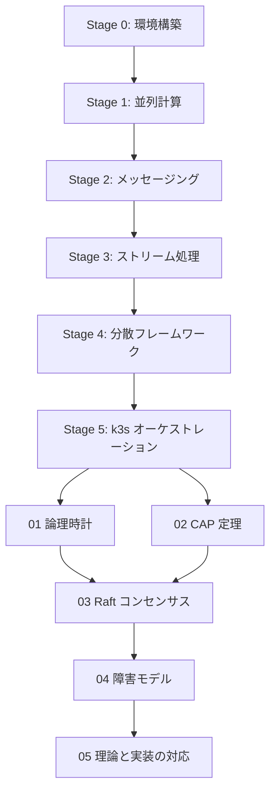

# ステージ6 学習ガイド：分散システムの理論

## 概要

ステージ6では、ここまでの実装（NATS・Redpanda・Ray・k3s）を支える**理論的基盤**を学びます。
「なぜこの設計になっているのか」を説明できるようになることが目標です。

## 依存グラフ

## ステップ一覧

| No. | ファイル | テーマ |
|-----|---------|--------|
| 01 | `docs/stage6/01-logical-clocks.md` | 論理時計（Lamport・ベクタークロック） |
| 02 | `docs/stage6/02-cap-theorem.md` | CAP 定理と整合性モデル |
| 03 | `docs/stage6/03-raft-consensus.md` | Raft コンセンサスアルゴリズム |
| 04 | `docs/stage6/04-fault-models.md` | 障害モデルとネットワーク分断 |
| 05 | `docs/stage6/05-theory-to-practice.md` | 理論と実装の対応（k3s/NATS/Redpanda） |

## Python シミュレーション

| ファイル | 内容 |
|---------|------|
| `python/stage6/01_lamport_clock.py` | Lamport 論理時計のシミュレーション |
| `python/stage6/02_vector_clock.py` | ベクタークロックと因果関係の検出 |
| `python/stage6/03_raft_sim.py` | Raft リーダー選出のシミュレーション |
| `python/stage6/04_cap_demo.py` | CAP トレードオフのデモ（AP vs CP） |

## 各ステージとの理論的対応

| 実装（Stage 0–5） | 背景理論（Stage 6） |
|------------------|-------------------|
| NATS の at-least-once 配信 | メッセージ順序・論理時計 |
| Redpanda のパーティション | データ分散・一貫性モデル |
| Ray の ObjectRef 参照 | 因果一貫性・イベント順序 |
| k3s の etcd（Raft ベース） | Raft コンセンサス |
| k3s の Pod 再起動・liveness | 障害検知・フェイルオーバー |
| Redpanda の consumer group | 分散合意・オフセット管理 |

## 学習の進め方

1. `01-logical-clocks.md` を読んで **シミュレーションを動かす**
2. `02-cap-theorem.md` で各システムの位置を確認する
3. `03-raft-consensus.md` を読んで k3s の etcd が何をしているか理解する
4. `04-fault-models.md` で障害の分類を把握する
5. `05-theory-to-practice.md` でステージ0–5 の実装に理論を当てはめる

## Stage 6 完了チェックリスト

- [ ] 物理クロックが分散システムで信頼できない理由を説明できる
- [ ] happens-before 関係（`→`）を定義できる
- [ ] Lamport クロックの更新ルールを説明できる
- [ ] `01_lamport_clock.py` を実行し、受信時に時計が進むのを確認した
- [ ] Lamport クロックでは「同時」を判定できない理由を説明できる
- [ ] ベクタークロックで happens-before と concurrent を判定できた
- [ ] CAP 定理の 3 要素を説明し、なぜ CP か AP を選ぶことになるか説明できる
- [ ] `04_cap_demo.py` で CP（書き込み拒否）と AP（結果整合性）の違いを確認した
- [ ] Raft の 3 つの役割（Leader / Follower / Candidate）を説明できる
- [ ] クォーラム（過半数）が必要な理由と、N=2f+1 の関係を説明できる
- [ ] `03_raft_sim.py` でリーダー選出と障害後の再選出を確認した
- [ ] クラッシュ障害とビザンチン障害の違いを説明できる
- [ ] Stage 0–5 の各実装がどの理論に対応するか説明できる

## 参考文献

- [Designing Data-Intensive Applications (Kleppmann)](https://dataintensive.net/)
- [In Search of an Understandable Consensus Algorithm (Raft 論文)](https://raft.github.io/raft.pdf)
- [Lamport, 1978: Time, Clocks, and the Ordering of Events](https://lamport.azurewebsites.net/pubs/time-clocks.pdf)
- [Brewer, 2000: CAP Conjecture / Gilbert & Lynch 証明](https://groups.csail.mit.edu/tds/papers/Gilbert/Brewer2.pdf)
